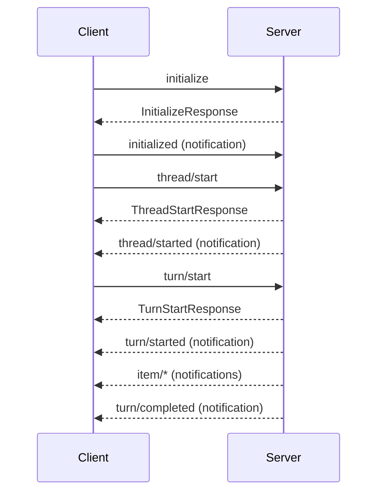

# codex-rs/app-server/README.md 研究文档

## 场景与职责

`README.md` 是 `codex-app-server` 模块的权威 API 文档，面向构建 Codex 客户端集成的开发者。该文档详细描述了 JSON-RPC 2.0 协议、消息模式、生命周期管理、事件流和认证流程。

### 目标读者
- IDE 扩展开发者 (如 VS Code 扩展)
- CLI 工具集成者
- 第三方客户端实现者

### 文档范围
- 传输协议规范 (stdio/WebSocket)
- JSON-RPC 消息格式
- Thread/Turn/Item 核心概念
- 完整 API 参考
- 认证和授权流程
- 实验性 API 门控机制

## 功能点目的

### 1. 协议规范

#### 传输层
| 传输方式 | URL 格式 | 状态 | 用途 |
|----------|----------|------|------|
| stdio (默认) | `stdio://` | 稳定 | CLI 集成 |
| WebSocket | `ws://IP:PORT` | 实验性 | 远程/图形客户端 |

#### 健康检查端点 (WebSocket 模式)
- `GET /readyz` - 服务就绪检查
- `GET /healthz` - 健康检查 (拒绝带 Origin 头的请求)

### 2. 核心概念模型

```
Thread (会话)
├── 元数据: id, preview, modelProvider, createdAt, status
├── 配置: model, approvalPolicy, sandboxPolicy
└── Turns (对话轮次)
    ├── User input (text, image, skill mention)
    └── Items (执行单元)
        ├── userMessage
        ├── agentMessage
        ├── commandExecution
        ├── fileChange
        ├── mcpToolCall
        └── ...
```

### 3. 生命周期管理



## 具体技术实现

### 1. 协议实现架构

#### JSON-RPC 消息类型
```rust
// codex-app-server-protocol/src/jsonrpc_lite.rs
pub enum JSONRPCMessage {
    Request(JSONRPCRequest),
    Response(JSONRPCResponse),
    Notification(JSONRPCNotification),
    Error(JSONRPCError),
}
```

#### 请求路由 (common.rs)
```rust
client_request_definitions! {
    Initialize { ... },
    ThreadStart => "thread/start" { ... },
    TurnStart => "turn/start" { ... },
    // ... 50+ methods
}
```

### 2. 关键 API 实现

#### Thread 管理
| 方法 | 处理器 | 功能 |
|------|--------|------|
| `thread/start` | `handle_thread_start` | 创建新会话 |
| `thread/resume` | `handle_thread_resume` | 恢复已有会话 |
| `thread/fork` | `handle_thread_fork` | 分支会话 |
| `thread/list` | `handle_thread_list` | 分页查询 |
| `thread/read` | `handle_thread_read` | 读取详情 |

**代码路径**: `codex_message_processor.rs:handle_thread_*`

#### Turn 执行
```rust
// turn/start 处理流程
1. 解析 ThreadId 和输入项
2. 创建或获取 CodexThread
3. 构建 UserInput (text/image/skill/mention)
4. 提交 Op::UserTurn 到线程
5. 返回 Turn 对象，事件通过通知流发送
```

**代码路径**: `codex_message_processor.rs:handle_turn_start`

#### 事件流
```rust
// 事件类型 (v2.rs)
pub enum ServerNotification {
    ThreadStarted(...),
    TurnCompleted(...),
    ItemStarted(...),
    ItemCompleted(...),
    // ... 20+ variants
}
```

### 3. 认证实现

#### 认证模式
```rust
pub enum AuthMode {
    ApiKey,      // 直接提供 OpenAI API Key
    Chatgpt,     // ChatGPT OAuth (Codex 管理令牌)
}
```

#### 流程
1. `account/read` - 检查当前认证状态
2. `account/login/start` - 启动登录流程
3. 浏览器完成 OAuth 授权
4. `account/login/completed` - 登录完成通知
5. `account/updated` - 认证状态变更通知

**代码路径**: `codex_message_processor.rs:handle_login_account`

### 4. 实验性 API 门控

#### 注解宏
```rust
// 方法级门控
#[experimental("thread/realtime/start")]
ThreadRealtimeStart => "thread/realtime/start" { ... }

// 字段级门控
#[experimental("thread/start.myField")]
pub my_field: Option<String>,

// 嵌套门控
#[experimental(nested)]
pub approval_policy: Option<AskForApproval>,
```

#### 运行时检查
```rust
// message_processor.rs
if let Some(reason) = codex_request.experimental_reason() {
    if !session.experimental_api_enabled {
        // 返回错误: "{reason} requires experimentalApi capability"
    }
}
```

## 关键代码路径与文件引用

### 协议定义

| 文件 | 内容 | 行数 |
|------|------|------|
| `protocol/v2.rs` | API v2 类型定义 | 2000+ |
| `protocol/common.rs` | 请求路由宏 | 500+ |
| `protocol/v1.rs` | 遗留 API 类型 | 200+ |
| `experimental_api.rs` | 实验性注解 | 100+ |

### 服务器实现

| 文件 | 职责 | 关键函数 |
|------|------|----------|
| `message_processor.rs` | 请求路由 | `process_request`, `handle_client_request` |
| `codex_message_processor.rs` | 业务逻辑 | `handle_thread_*`, `handle_turn_*` |
| `transport.rs` | 传输层 | `start_stdio_connection`, `start_websocket_acceptor` |
| `in_process.rs` | 进程内运行时 | `start`, `InProcessClientHandle` |
| `thread_state.rs` | 线程状态 | `ThreadStateManager` |

### 事件处理

| 文件 | 职责 |
|------|------|
| `outgoing_message.rs` | 消息发送和路由 |
| `bespoke_event_handling.rs` | 自定义事件处理 |
| `filters.rs` | 事件过滤 |

## 依赖与外部交互

### 客户端集成

```
┌─────────────────────────────────────────────────────────────┐
│                      Client (VS Code/CLI)                   │
├─────────────────────────────────────────────────────────────┤
│  1. Spawn process: codex app-server --listen stdio://       │
│  2. Send initialize request                                  │
│  3. Receive initialized notification                        │
│  4. Send thread/start                                        │
│  5. Stream notifications from stdout                        │
└─────────────────────────────────────────────────────────────┘
                              │
                              ▼
┌─────────────────────────────────────────────────────────────┐
│                    codex-app-server                         │
│  ┌──────────────┐  ┌──────────────┐  ┌──────────────┐       │
│  │   Transport  │─▶│   Message    │─▶│    Codex     │       │
│  │    Layer     │  │   Processor  │  │   Processor  │       │
│  └──────────────┘  └──────────────┘  └──────────────┘       │
│         │                 │                 │               │
│         ▼                 ▼                 ▼               │
│  ┌──────────────┐  ┌──────────────┐  ┌──────────────┐       │
│  │   stdio/WS   │  │  JSON-RPC    │  │  codex-core  │       │
│  │              │  │  Router      │  │  ThreadMgr   │       │
│  └──────────────┘  └──────────────┘  └──────────────┘       │
└─────────────────────────────────────────────────────────────┘
```

### 外部服务

| 服务 | 用途 | 相关 API |
|------|------|----------|
| OpenAI API | LLM 推理 | 通过 `codex-backend-client` |
| ChatGPT OAuth | 用户认证 | `account/login/start` |
| MCP Servers | 外部工具 | `mcpServer/*` |

## 风险、边界与改进建议

### 当前风险

1. **WebSocket 传输实验性**
   - **风险**: 生产环境不稳定
   - **缓解**: 明确标记为实验性，推荐 stdio 用于生产

2. **API 版本兼容性**
   - **风险**: v1 和 v2 并存增加维护负担
   - **现状**: v2 是主要开发目标，v1 仅维护

3. **实验性 API 管理**
   - **风险**: 实验性功能可能突然变更
   - **缓解**: 严格的门控机制和文档警告

### 边界条件

| 边界 | 限制 | 说明 |
|------|------|------|
| 消息大小 | 受通道容量限制 | `CHANNEL_CAPACITY = 128` |
| 并发连接 | WebSocket 无硬性限制 | 依赖系统资源 |
| 线程数量 | 受内存限制 | 每个线程维护完整上下文 |
| 历史记录 | 可配置自动压缩 | `model_auto_compact_token_limit` |

### 改进建议

1. **协议文档自动化**
   - 从 Rust 类型自动生成 OpenAPI/Swagger 规范
   - 与 `generate-json-schema` 命令集成

2. **错误码标准化**
   - 当前错误码分散在多个文件
   - 建议统一在 `error_code.rs` 中定义

3. **性能监控**
   - 添加 `thread/latency` 指标 API
   - 暴露 Prometheus 格式的指标端点

4. **安全加固**
   ```rust
   // 建议添加请求速率限制
   pub struct RateLimiter {
       requests_per_second: u32,
       burst_size: u32,
   }
   ```

5. **测试覆盖**
   - 增加 WebSocket 传输的集成测试
   - 添加实验性 API 的兼容性测试

### 相关文档

- [API Schema Fixtures](../../codex-app-server-protocol/tests/fixtures/) - 协议测试固件
- [AGENTS.md](../../../../AGENTS.md) - 项目开发规范
- [docs/](../../../../../docs/) - 用户级文档

---

## 附录: API 速查表

### Thread API
```
thread/start, thread/resume, thread/fork
thread/list, thread/loaded/list, thread/read
thread/archive, thread/unarchive
thread/metadata/update, thread/name/set
thread/compact/start, thread/shellCommand
thread/rollback, thread/unsubscribe
thread/backgroundTerminals/clean (实验性)
thread/realtime/* (实验性)
```

### Turn API
```
turn/start, turn/steer, turn/interrupt
review/start
```

### Command API
```
command/exec, command/exec/write
command/exec/resize, command/exec/terminate
```

### FS API
```
fs/readFile, fs/writeFile
fs/createDirectory, fs/remove
fs/readDirectory, fs/getMetadata
fs/copy
```

### Config API
```
config/read, config/value/write, config/batchWrite
configRequirements/read
externalAgentConfig/detect, externalAgentConfig/import
```

### Auth API
```
account/read, account/login/start, account/login/cancel
account/logout, account/rateLimits/read
```

### MCP API
```
mcpServer/oauth/login, mcpServerStatus/list
config/mcpServer/reload
```
