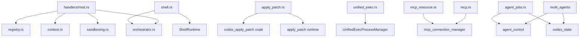

# Research: DIR codex-rs/core/src/tools/handlers

## 场景与职责

`codex-rs/core/src/tools/handlers` 是 Codex 工具系统的核心处理器目录，负责实现所有 AI 可调用的工具（Tools）的具体执行逻辑。该目录位于 Codex Rust 核心代码库中，是连接模型意图与实际系统操作的桥梁。

### 核心职责

1. **工具执行**: 实现 20+ 种工具的具体执行逻辑，包括文件操作、代码编辑、Shell 执行、Agent 协作等
2. **权限管控**: 集成沙箱系统，确保所有敏感操作都经过适当的权限审批
3. **结果格式化**: 将工具执行结果转换为模型可理解的格式
4. **事件通知**: 向客户端发送工具执行状态事件，支持 TUI 实时展示

### 使用场景

- **代码编辑**: 通过 `apply_patch` 工具安全地修改代码文件
- **文件浏览**: 使用 `read_file`、`list_dir`、`grep_files` 浏览代码库
- **命令执行**: 通过 `shell`、`shell_command`、`unified_exec` 执行系统命令
- **Agent 协作**: 使用多 Agent 工具（`spawn_agent`、`send_input`、`wait_agent` 等）实现并行任务处理
- **MCP 集成**: 通过 `mcp`、`mcp_resource` 调用外部 MCP 服务器工具
- **权限申请**: 通过 `request_permissions` 动态申请额外权限

---

## 功能点目的

### 1. 文件操作类工具

| 工具 | 文件 | 目的 |
|------|------|------|
| `read_file` | `read_file.rs` | 读取文件内容，支持行号切片和缩进感知模式 |
| `list_dir` | `list_dir.rs` | 列出目录内容，支持深度限制和分页 |
| `grep_files` | `grep_files.rs` | 使用 ripgrep 搜索文件内容 |
| `apply_patch` | `apply_patch.rs` | 安全地应用代码补丁，支持 Add/Update/Delete 操作 |

### 2. 命令执行类工具

| 工具 | 文件 | 目的 |
|------|------|------|
| `shell` | `shell.rs` | 执行数组形式的 shell 命令 |
| `shell_command` | `shell.rs` | 执行字符串形式的 shell 命令 |
| `unified_exec` | `unified_exec.rs` | 统一执行框架，支持 TTY 和交互式命令 |

### 3. Agent 协作类工具

| 工具 | 文件 | 目的 |
|------|------|------|
| `spawn_agent` | `multi_agents/spawn.rs` | 创建子 Agent 处理并行任务 |
| `close_agent` | `multi_agents/close_agent.rs` | 关闭指定 Agent |
| `send_input` | `multi_agents/send_input.rs` | 向 Agent 发送输入 |
| `wait_agent` | `multi_agents/wait.rs` | 等待 Agent 完成 |
| `resume_agent` | `multi_agents/resume_agent.rs` | 恢复已关闭的 Agent |

### 4. MCP 集成类工具

| 工具 | 文件 | 目的 |
|------|------|------|
| `mcp` | `mcp.rs` | 调用 MCP 服务器工具 |
| `mcp_resource` | `mcp_resource.rs` | 访问 MCP 资源（list/read resources） |

### 5. 其他工具

| 工具 | 文件 | 目的 |
|------|------|------|
| `tool_search` | `tool_search.rs` | 使用 BM25 算法搜索可用工具 |
| `tool_suggest` | `tool_suggest.rs` | 向用户推荐并安装工具 |
| `request_permissions` | `request_permissions.rs` | 申请额外权限 |
| `request_user_input` | `request_user_input.rs` | 请求用户输入 |
| `view_image` | `view_image.rs` | 加载并查看本地图片 |
| `update_plan` | `plan.rs` | 更新任务计划 |
| `artifacts` | `artifacts.rs` | 执行 Artifact JavaScript 代码 |
| `js_repl` | `js_repl.rs` | JavaScript REPL 执行 |
| `agent_jobs` | `agent_jobs.rs` | 批量 CSV 任务处理 |
| `test_sync` | `test_sync.rs` | 测试同步工具（Barrier 同步） |

---

## 具体技术实现

### 关键流程

#### 1. 工具调用流程

```
ToolRouter::dispatch_tool_call_with_code_mode_result
  └── ToolRegistry::dispatch_any
      └── ToolHandler::handle
```

**关键代码路径**:
- `codex-rs/core/src/tools/router.rs:214-251` - 工具路由分发
- `codex-rs/core/src/tools/registry.rs:160-312` - 注册表调度逻辑

#### 2. 权限审批流程

```
ToolOrchestrator::run
  ├── 1. Approval (权限审批)
  │   └── Approvable::start_approval_async
  ├── 2. First Attempt (首次沙箱尝试)
  │   └── ToolRuntime::run
  └── 3. Retry without Sandbox (如需要，无沙箱重试)
```

**关键代码路径**:
- `codex-rs/core/src/tools/orchestrator.rs:100-347` - 编排器主流程

#### 3. apply_patch 执行流程

```
ApplyPatchHandler::handle
  ├── codex_apply_patch::maybe_parse_apply_patch_verified (解析补丁)
  ├── effective_patch_permissions (计算权限)
  ├── apply_patch::apply_patch (尝试应用)
  └── 如需要: ToolOrchestrator::run (委托执行)
```

**关键代码路径**:
- `codex-rs/core/src/tools/handlers/apply_patch.rs:146-257`

#### 4. Agent 批量任务流程 (agent_jobs)

```
BatchJobHandler::handle
  └── spawn_agents_on_csv::handle
      ├── parse_csv (解析 CSV)
      ├── create_agent_job (创建任务)
      └── run_agent_job_loop (执行循环)
          ├── spawn_agent (创建 Worker)
          ├── wait_for_final_status (等待完成)
          └── export_job_csv_snapshot (导出结果)
```

**关键代码路径**:
- `codex-rs/core/src/tools/handlers/agent_jobs.rs:221-467`

### 关键数据结构

#### ToolInvocation (工具调用上下文)
```rust
pub struct ToolInvocation {
    pub session: Arc<Session>,           // 会话上下文
    pub turn: Arc<TurnContext>,          // 当前 Turn 上下文
    pub tracker: SharedTurnDiffTracker,  // 差异追踪
    pub call_id: String,                 // 调用 ID
    pub tool_name: String,               // 工具名称
    pub tool_namespace: Option<String>,  // 命名空间
    pub payload: ToolPayload,            // 负载数据
}
```

#### ToolPayload (工具负载类型)
```rust
pub enum ToolPayload {
    Function { arguments: String },           // JSON 参数
    ToolSearch { arguments: SearchToolCallParams },
    Custom { input: String },                 // 自由格式输入
    LocalShell { params: ShellToolCallParams },
    Mcp { server: String, tool: String, raw_arguments: String },
}
```

#### ToolHandler Trait (处理器接口)
```rust
#[async_trait]
pub trait ToolHandler: Send + Sync {
    type Output: ToolOutput + 'static;
    fn kind(&self) -> ToolKind;
    fn matches_kind(&self, payload: &ToolPayload) -> bool;
    async fn is_mutating(&self, _invocation: &ToolInvocation) -> bool;
    async fn handle(&self, invocation: ToolInvocation) -> Result<Self::Output, FunctionCallError>;
}
```

### 协议与命令

#### 1. apply_patch 补丁格式

使用自定义补丁语言，语法定义在 `tool_apply_patch.lark`:

```
*** Begin Patch
*** Add File: <path>
+<content>
*** Update File: <path>
*** Move to: <new_path> (可选)
@@ <context>
-<old_line>
+<new_line>
*** Delete File: <path>
*** End Patch
```

#### 2. Shell 命令执行参数

```rust
pub struct ShellToolCallParams {
    pub command: Vec<String>,           // 命令数组
    pub workdir: Option<String>,        // 工作目录
    pub timeout_ms: Option<u64>,        // 超时
    pub sandbox_permissions: Option<SandboxPermissions>,
    pub additional_permissions: Option<PermissionProfile>,
    pub prefix_rule: Option<Vec<String>>,
    pub justification: Option<String>,
}
```

#### 3. Agent 协作消息格式

```rust
pub struct SpawnAgentArgs {
    pub message: Option<String>,
    pub items: Option<Vec<UserInput>>,
    pub agent_type: Option<String>,    // 角色类型
    pub model: Option<String>,          // 指定模型
    pub reasoning_effort: Option<ReasoningEffort>,
    pub fork_context: bool,
}
```

---

## 关键代码路径与文件引用

### 核心文件结构

```
codex-rs/core/src/tools/handlers/
├── mod.rs                    # 模块导出，权限验证工具函数
├── apply_patch.rs            # 代码补丁应用 (466 lines)
├── shell.rs                  # Shell 命令执行 (499 lines)
├── unified_exec.rs           # 统一执行框架 (362 lines)
├── read_file.rs              # 文件读取 (489 lines)
├── list_dir.rs               # 目录列表 (271 lines)
├── grep_files.rs             # 文件搜索 (176 lines)
├── mcp.rs                    # MCP 工具调用 (58 lines)
├── mcp_resource.rs           # MCP 资源访问 (667 lines)
├── dynamic.rs                # 动态工具 (134 lines)
├── js_repl.rs                # JavaScript REPL (296 lines)
├── artifacts.rs              # Artifact 执行 (295 lines)
├── plan.rs                   # 计划更新 (153 lines)
├── tool_search.rs            # 工具搜索 (192 lines)
├── tool_suggest.rs           # 工具推荐 (320 lines)
├── request_permissions.rs    # 权限申请 (74 lines)
├── request_user_input.rs     # 用户输入请求 (125 lines)
├── view_image.rs             # 图片查看 (230 lines)
├── agent_jobs.rs             # 批量 Agent 任务 (1000+ lines)
├── test_sync.rs              # 测试同步 (154 lines)
└── multi_agents/             # 多 Agent 协作子模块
    ├── mod.rs                # 公共函数和配置构建
    ├── spawn.rs              # 创建 Agent (198 lines)
    ├── close_agent.rs        # 关闭 Agent (125 lines)
    ├── send_input.rs         # 发送输入 (118 lines)
    ├── wait.rs               # 等待 Agent (228 lines)
    └── resume_agent.rs       # 恢复 Agent (167 lines)
```

### 依赖文件

| 依赖路径 | 用途 |
|----------|------|
| `codex-rs/core/src/tools/registry.rs` | ToolHandler trait 定义和注册表实现 |
| `codex-rs/core/src/tools/context.rs` | ToolInvocation, ToolPayload, ToolOutput 定义 |
| `codex-rs/core/src/tools/orchestrator.rs` | ToolOrchestrator 权限和沙箱编排 |
| `codex-rs/core/src/tools/sandboxing.rs` | 沙箱和审批 trait 定义 |
| `codex-rs/core/src/tools/spec.rs` | 工具 Schema 定义和构建 |
| `codex-rs/core/src/tools/router.rs` | 工具路由和分发 |
| `codex-rs/core/src/tools/events.rs` | 工具执行事件发射 |
| `codex-rs/core/src/sandboxing/mod.rs` | 沙箱权限类型定义 |
| `codex-rs/core/src/codex/mod.rs` | Session 和 TurnContext 定义 |

---

## 依赖与外部交互

### 内部依赖



### 外部 Crate 依赖

| Crate | 用途 |
|-------|------|
| `codex_protocol` | 协议类型（ThreadId, AgentStatus, EventMsg 等） |
| `codex_apply_patch` | 补丁解析和应用 |
| `codex_artifacts` | Artifact 运行时管理 |
| `codex_state` | Agent Job 状态存储 |
| `codex_hooks` | 工具使用后的 Hook 调用 |
| `codex_otel` | 遥测和指标收集 |
| `codex_utils_absolute_path` | 绝对路径处理 |
| `bm25` | 工具搜索的 BM25 算法 |
| `rmcp` | MCP 协议类型 |
| `async_trait` | 异步 trait 支持 |
| `serde`/`serde_json` | 序列化 |
| `tokio` | 异步运行时 |

### 与 Session/TurnContext 的交互

所有处理器都通过 `ToolInvocation` 接收:

- `session: Arc<Session>` - 访问 services（agent_control, mcp_connection_manager 等）
- `turn: Arc<TurnContext>` - 访问当前 Turn 的配置、沙箱策略、cwd 等
- `tracker: SharedTurnDiffTracker` - 追踪文件变更

**关键交互示例**:
```rust
// 发送事件到客户端
session.send_event(turn, EventMsg::Xxx(...)).await;

// 调用 Agent 控制
session.services.agent_control.spawn_agent(...).await;

// 访问 MCP 工具
session.services.mcp_connection_manager.read().await.list_all_tools();

// 请求权限
session.request_permissions(turn, call_id, args).await;
```

---

## 风险、边界与改进建议

### 已知风险

1. **权限提升风险**
   - `additional_permissions` 和 `sandbox_permissions` 的组合需要严格验证
   - `normalize_and_validate_additional_permissions` 函数（mod.rs:102-159）是安全关键路径

2. **命令注入风险**
   - Shell 工具使用 `is_known_safe_command` 进行安全检查
   - 但仍需警惕通过 `additional_permissions` 绕过的场景

3. **Agent 深度限制**
   - `agent_max_depth` 配置防止无限递归创建 Agent
   - 超过限制时返回 `"Agent depth limit reached"` 错误

4. **CSV 任务超时**
   - `agent_jobs.rs` 的 `DEFAULT_AGENT_JOB_ITEM_TIMEOUT` 为 30 分钟
   - 长时间运行的 Worker 可能导致资源泄漏

### 边界情况

1. **apply_patch 并发**
   - 同一文件的并发修改可能导致冲突
   - 依赖 `TurnDiffTracker` 进行变更追踪

2. **MCP 服务器不可用**
   - `mcp.rs` 和 `mcp_resource.rs` 需要处理服务器断开情况
   - 当前实现会返回错误给模型

3. **Barrier 同步泄漏**
   - `test_sync.rs` 的 Barrier 在超时后可能残留
   - Leader 负责清理，但异常情况下可能泄漏

4. **图片大小限制**
   - `view_image.rs` 依赖 `load_for_prompt_bytes` 进行图片处理
   - 超大图片可能导致内存问题

### 改进建议

1. **性能优化**
   - `grep_files.rs` 当前使用 `rg` 进程调用，可考虑集成 `ripgrep` crate 直接调用
   - `tool_search.rs` 的 BM25 索引可缓存，避免每次重建

2. **错误处理增强**
   - 统一工具错误码，便于客户端处理
   - 增加更多可恢复错误的重试逻辑

3. **可观测性**
   - 为每个工具增加详细的执行指标（延迟、成功率、资源使用）
   - 增加工具调用链追踪（特别是 Agent 协作场景）

4. **安全加固**
   - 对 `dynamic.rs` 的动态工具调用增加更多验证
   - 考虑为 `js_repl.rs` 和 `artifacts.rs` 增加执行资源限制

5. **代码重构**
   - `agent_jobs.rs` 超过 1000 行，建议按功能拆分为子模块
   - `multi_agents/mod.rs` 的 `build_agent_spawn_config` 逻辑可进一步简化

---

## 测试覆盖

每个处理器都有对应的测试文件:

| 处理器 | 测试文件 |
|--------|----------|
| apply_patch | `apply_patch_tests.rs` |
| shell | `shell_tests.rs` |
| unified_exec | `unified_exec_tests.rs` |
| read_file | `read_file_tests.rs` |
| list_dir | `list_dir_tests.rs` |
| grep_files | `grep_files_tests.rs` |
| js_repl | `js_repl_tests.rs` |
| mcp_resource | `mcp_resource_tests.rs` |
| multi_agents | `multi_agents_tests.rs` |
| request_user_input | `request_user_input_tests.rs` |
| tool_search | `tool_search_tests.rs` |
| tool_suggest | `tool_suggest_tests.rs` |
| artifacts | `artifacts_tests.rs` |

---

*Generated: 2026-03-21*
*Research Scope: codex-rs/core/src/tools/handlers/*
