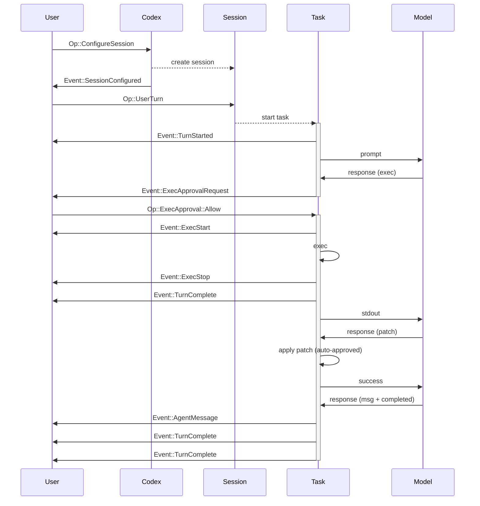
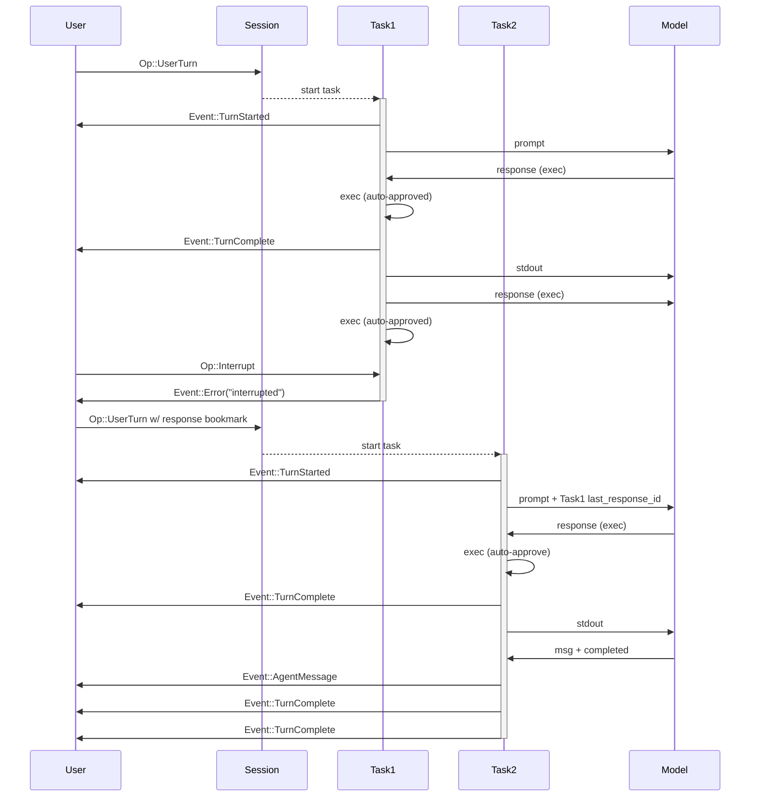

# Codex Protocol V1 研究文档

## 场景与职责

本文档描述 Codex 核心系统的协议规范，定义了客户端（UI）与 Codex 引擎之间的通信协议。该协议使用 SQ（Submission Queue）/ EQ（Event Queue）模式进行异步通信。

### 核心定位

- **协议文件**: `codex-rs/protocol/src/protocol.rs`
- **补充实现**: `codex-rs/core/src/agent.rs`（Agent 实现）
- **目标**: 建立共享术语和系统行为预期，支持多种 UI 实现（CLI/TUI、VS Code 扩展等）

### 系统架构

```
┌─────────────┐     SQ (Submission Queue)      ┌─────────────┐
│             │ ─────────────────────────────> │             │
│     UI      │                                │    Codex    │
│  (Client)   │ <───────────────────────────── │   (Agent)   │
│             │     EQ (Event Queue)           │             │
└─────────────┘                                └─────────────┘
                                                      │
                                                      v
                                               ┌─────────────┐
                                               │    Model    │
                                               │ (OpenAI API)│
                                               └─────────────┘
```

## 功能点目的

### 1. 核心实体定义

| 实体 | 描述 | 生命周期 |
|------|------|----------|
| **Model** | OpenAI Responses REST API | 外部服务 |
| **Codex** | 核心引擎，本地运行 | 长期运行 |
| **Session** | 当前配置和状态 | 可重新配置 |
| **Task** | 响应用户输入执行的工作单元 | 单次用户输入 |
| **Turn** | Task 中的一个迭代周期 | 单次模型调用 |

### 2. 关键操作（Op）

| 操作 | 用途 | 关键字段 |
|------|------|----------|
| `UserTurn` | 启动新一轮对话 | items, cwd, approval_policy, sandbox_policy, model |
| `UserInput` | 传统用户输入（已弃用） | items, final_output_json_schema |
| `Interrupt` | 中断当前任务 | - |
| `ExecApproval` | 批准命令执行 | id, decision |
| `PatchApproval` | 批准代码补丁 | id, decision |
| `OverrideTurnContext` | 覆盖回合上下文 | cwd, approval_policy, sandbox_policy, model, ... |

### 3. 事件消息（EventMsg）

| 事件 | 触发时机 | 用途 |
|------|----------|------|
| `TurnStarted` | 回合开始 | 包含 model_context_window, collaboration_mode_kind |
| `TurnComplete` | 回合完成 | 包含 response_id（用于后续恢复） |
| `AgentMessage` | 模型返回消息 | 助手回复内容 |
| `AgentMessageContentDelta` | 流式文本增量 | 实时显示 |
| `PlanDelta` | 计划模式流式文本 | 显示建议计划 |
| `ExecApprovalRequest` | 请求执行批准 | 包含命令详情 |
| `RequestUserInput` | 请求用户输入 | 问题列表和选项 |
| `Error` | 错误发生 | 错误信息 |
| `Warning` | 非致命警告 | 警告信息 |

### 4. 沙箱策略（SandboxPolicy）

| 策略 | 描述 | 使用场景 |
|------|------|----------|
| `DangerFullAccess` | 无限制访问 | 危险模式 |
| `ReadOnly` | 只读访问，可选网络 | 安全浏览 |
| `ExternalSandbox` | 外部沙箱环境 | 容器/VM 内运行 |
| `WorkspaceWrite` | 可写工作目录 | 默认开发模式 |

### 5. 审批策略（AskForApproval）

| 策略 | 描述 |
|------|------|
| `UnlessTrusted` | 仅自动批准"已知安全"的只读命令 |
| `OnFailure` | 已弃用，失败时询问 |
| `OnRequest` | 模型决定何时询问（默认） |
| `Granular` | 细粒度控制各类审批 |
| `Never` | 从不询问，直接失败 |

## 具体技术实现

### 1. 协议数据结构

#### Submission（提交）

```rust
#[derive(Debug, Clone, Deserialize, Serialize, JsonSchema)]
pub struct Submission {
    /// 唯一 ID，用于与 Events 关联
    pub id: String,
    /// 操作负载
    pub op: Op,
    /// 可选的 W3C 追踪上下文
    #[serde(default, skip_serializing_if = "Option::is_none")]
    pub trace: Option<W3cTraceContext>,
}
```

#### Op 枚举（部分）

```rust
#[derive(Debug, Clone, Deserialize, Serialize, PartialEq, JsonSchema)]
#[serde(tag = "type", rename_all = "snake_case")]
#[non_exhaustive]
pub enum Op {
    Interrupt,
    CleanBackgroundTerminals,
    
    UserTurn {
        items: Vec<UserInput>,
        cwd: PathBuf,
        approval_policy: AskForApproval,
        sandbox_policy: SandboxPolicy,
        model: String,
        effort: Option<ReasoningEffortConfig>,
        summary: Option<ReasoningSummaryConfig>,
        service_tier: Option<Option<ServiceTier>>,
        final_output_json_schema: Option<Value>,
        collaboration_mode: Option<CollaborationMode>,
        personality: Option<Personality>,
    },
    
    ExecApproval {
        id: String,
        turn_id: Option<String>,
        decision: ReviewDecision,
    },
    
    // ... 更多变体
}
```

### 2. 用户输入项类型

`Op::UserTurn` 支持的内容项：

```rust
// text - 纯文本
{ "type": "text", "text": "解释这个 diff" }

// image - 网络图片
{ "type": "image", "url": "https://...png" }

// local_image - 本地图片
{ "type": "local_image", "path": "/tmp/screenshot.png" }

// skill - 显式技能选择
{ "type": "skill", "name": "skill-creator", "path": "/path/to/SKILL.md" }

// mention - 应用/连接器选择
{ "type": "mention", "name": "Demo App", "path": "app://demo-app" }
```

### 3. 沙箱策略详细配置

#### ReadOnly 策略

```rust
SandboxPolicy::ReadOnly {
    access: ReadOnlyAccess::Restricted {
        include_platform_defaults: true,
        readable_roots: vec!["/custom/path"],
    },
    network_access: false,
}
```

#### WorkspaceWrite 策略

```rust
SandboxPolicy::WorkspaceWrite {
    writable_roots: vec![],
    read_only_access: ReadOnlyAccess::FullAccess,
    network_access: false,
    exclude_tmpdir_env_var: false,
    exclude_slash_tmp: false,
}
```

### 4. 传输层

支持多种传输方式：

- **跨线程通道**: 单进程内通信
- **IPC 通道**: 进程间通信
- **stdin/stdout**: 行分隔 JSON
- **TCP**: 流式 JSON
- **HTTP2**: 多路复用流
- **gRPC**: 强类型 RPC

非帧传输（stdio/TCP）使用行分隔 JSON（JSONL）。

### 5. 典型交互流程

#### 基本 UI 流程



#### 任务中断流程



## 关键代码路径与文件引用

### 核心协议文件

| 文件路径 | 内容 |
|----------|------|
| `codex-rs/protocol/src/protocol.rs` | 协议定义（Op、EventMsg、Submission、Event） |
| `codex-rs/protocol/src/lib.rs` | 模块导出和公共 API |
| `codex-rs/docs/protocol_v1.md` | 本文档的源文件 |

### 相关类型定义

| 文件路径 | 内容 |
|----------|------|
| `codex-rs/protocol/src/config_types.rs` | 配置类型（CollaborationMode、Personality 等） |
| `codex-rs/protocol/src/approvals.rs` | 审批相关类型 |
| `codex-rs/protocol/src/permissions.rs` | 权限策略类型 |
| `codex-rs/protocol/src/user_input.rs` | 用户输入类型 |
| `codex-rs/protocol/src/models.rs` | 模型相关类型 |

### 实现文件

| 文件路径 | 内容 |
|----------|------|
| `codex-rs/core/src/codex.rs` | Codex 核心实现 |
| `codex-rs/core/src/session.rs` | Session 管理 |
| `codex-rs/core/src/task.rs` | Task 执行逻辑 |
| `codex-rs/core/src/turn.rs` | Turn 处理 |

### 使用示例

| 文件路径 | 内容 |
|----------|------|
| `codex-rs/tui/src/app.rs` | TUI 中的协议使用 |
| `codex-rs/cli/src/main.rs` | CLI 中的协议使用 |

## 依赖与外部交互

### 1. 协议 crate 依赖

```rust
// 序列化
codex_protocol: 使用 serde、serde_json 进行序列化
schemars: JSON Schema 生成
ts_rs: TypeScript 类型生成

// 工具
codex_utils_absolute_path: 绝对路径处理
tracing: 日志记录
strum_macros: 枚举工具
```

### 2. 特殊标签常量

```rust
pub const USER_INSTRUCTIONS_OPEN_TAG: &str = "<user_instructions>";
pub const USER_INSTRUCTIONS_CLOSE_TAG: &str = "</user_instructions>";
pub const ENVIRONMENT_CONTEXT_OPEN_TAG: &str = "<environment_context>";
pub const ENVIRONMENT_CONTEXT_CLOSE_TAG: &str = "</environment_context>";
pub const APPS_INSTRUCTIONS_OPEN_TAG: &str = "<apps_instructions>";
pub const SKILLS_INSTRUCTIONS_OPEN_TAG: &str = "<skills_instructions>";
pub const PLUGINS_INSTRUCTIONS_OPEN_TAG: &str = "<plugins_instructions>";
pub const COLLABORATION_MODE_OPEN_TAG: &str = "<collaboration_mode>";
pub const REALTIME_CONVERSATION_OPEN_TAG: &str = "<realtime_conversation>";
pub const USER_MESSAGE_BEGIN: &str = "## My request for Codex:";
```

### 3. 与 OpenAI API 的交互

- 使用 `response_id` 进行对话恢复
- 支持 `last_response_id` 参数继续对话
- 与 `/responses` 端点兼容

### 4. 向后兼容性

```rust
// v1 兼容性：序列化时使用 task_started/task_complete
// 反序列化时接受 task_* 和 turn_* 两种标签
#[serde(alias = "task_started")]
TurnStarted,
#[serde(alias = "task_complete")]
TurnComplete,
```

## 风险、边界与改进建议

### 当前风险

1. **规范与代码不一致**: 文档注明"代码可能不完全匹配此规范"，存在一些需要调整的地方
2. **non_exhaustive 枚举**: `Op` 和 `EventMsg` 标记为 `#[non_exhaustive]`，未来可能添加新变体，客户端需要处理未知变体
3. **实验性功能**: `collaboration_mode`、`personality` 等功能处于实验阶段

### 边界条件

1. **并发限制**: 一个 Session 同时只能运行一个 Task
2. **上下文窗口**: 需要监控模型上下文窗口使用情况
3. **重配置中断**: 重新配置 Session 会中止任何正在运行的执行
4. **响应 ID 生命周期**: `response_id` 需要妥善保存以支持对话恢复

### 改进建议

1. **规范同步**:
   - 更新文档以匹配当前代码实现
   - 添加版本历史记录
   - 明确标记实验性功能

2. **协议增强**:
   - 添加更多元数据到事件（如时间戳、性能指标）
   - 支持更细粒度的进度报告
   - 改进错误分类和恢复建议

3. **传输优化**:
   - 评估二进制序列化格式（如 MessagePack）
   - 添加压缩支持
   - 实现流量控制机制

4. **开发者体验**:
   - 提供协议验证工具
   - 添加更多示例和测试用例
   - 改进文档和类型定义

5. **向后兼容性**:
   - 制定明确的弃用策略
   - 添加版本协商机制
   - 提供迁移指南

### 相关参考

- OpenAI Responses API: https://platform.openai.com/docs/api-reference/responses
- Protocol 文件: `codex-rs/protocol/src/protocol.rs`
- Agent 实现: `codex-rs/core/src/agent.rs`
