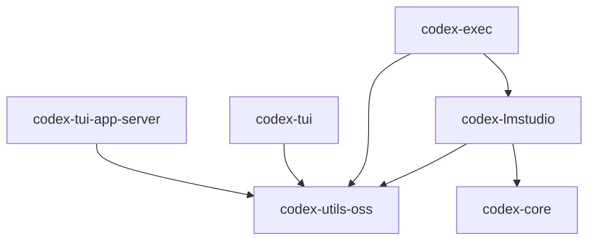

# codex-rs/lmstudio/src 目录深度研究文档

## 1. 场景与职责

### 1.1 模块定位

`codex-rs/lmstudio` crate 是 Codex CLI 项目中专门用于与 **LM Studio** 本地 AI 服务器集成的组件。LM Studio 是一个本地运行大语言模型的桌面应用程序，提供 OpenAI 兼容的 API 接口。

### 1.2 核心职责

该模块承担以下关键职责：

1. **本地 OSS (Open Source Software) 模型支持**：当用户使用 `--oss` 标志时，提供与本地 LM Studio 服务器的通信能力
2. **模型生命周期管理**：
   - 检测 LM Studio 服务器是否运行
   - 检查指定模型是否已下载
   - 触发模型下载（通过 `lms` CLI 工具）
   - 预加载模型到内存以提高响应速度
3. **与 OpenAI 兼容 API 交互**：使用 LM Studio 提供的 `/v1/models` 和 `/v1/responses` 端点

### 1.3 使用场景

```
用户执行: codex --oss "帮我写一个 Rust 函数"
                ↓
    系统检测到 --oss 标志
                ↓
    调用 ensure_oss_ready() 准备环境
                ↓
    检查 LM Studio 服务器状态 (端口 1234)
                ↓
    检查模型是否存在 (默认: openai/gpt-oss-20b)
                ↓
    如不存在，调用 lms get --yes <model> 下载
                ↓
    后台加载模型到内存
                ↓
    继续执行用户请求
```

## 2. 功能点目的

### 2.1 主要功能点

| 功能点 | 目的 | 所在文件 |
|--------|------|----------|
| `LMStudioClient` | HTTP 客户端，封装与 LM Studio API 的通信 | `client.rs` |
| `ensure_oss_ready()` | 入口函数，协调整个 OSS 环境准备流程 | `lib.rs` |
| `DEFAULT_OSS_MODEL` | 默认模型标识符 (`openai/gpt-oss-20b`) | `lib.rs` |
| `find_lms()` | 定位 `lms` 可执行文件（支持 PATH 和回退路径） | `client.rs` |
| `download_model()` | 调用 `lms get` 下载指定模型 | `client.rs` |
| `fetch_models()` | 获取 LM Studio 中已下载的模型列表 | `client.rs` |
| `load_model()` | 通过发送空请求预热/加载模型 | `client.rs` |

### 2.2 设计决策

1. **默认端口 1234**：LM Studio 的默认监听端口
2. **使用 `lms` CLI 而非直接 API 下载**：LM Studio 的模型下载需要通过其专用 CLI 工具 `lms` 完成
3. **后台加载模型**：使用 `tokio::spawn` 在后台异步加载模型，不阻塞主流程
4. **非致命错误处理**：查询模型列表失败时仅记录警告，允许上层稍后处理错误

## 3. 具体技术实现

### 3.1 关键数据结构

#### `LMStudioClient` (client.rs:7-10)

```rust
#[derive(Clone)]
pub struct LMStudioClient {
    client: reqwest::Client,
    base_url: String,
}
```

- 使用 `reqwest` 作为 HTTP 客户端
- 5 秒连接超时（client.rs:33）
- 支持 Clone，便于在异步任务间共享

#### 默认模型常量 (lib.rs:7)

```rust
pub const DEFAULT_OSS_MODEL: &str = "openai/gpt-oss-20b";
```

### 3.2 关键流程

#### 3.2.1 客户端初始化流程

```rust
// lib.rs:20
let lmstudio_client = LMStudioClient::try_from_provider(config).await?;
```

内部流程（client.rs:15-44）：
1. 从 `config.model_providers` 获取 `lmstudio` provider 配置
2. 提取 `base_url`（如 `http://localhost:1234/v1`）
3. 构建 `reqwest::Client` 并设置 5 秒连接超时
4. 调用 `check_server()` 验证服务器可达性

#### 3.2.2 服务器健康检查 (client.rs:46-62)

```rust
async fn check_server(&self) -> io::Result<()> {
    let url = format!("{}/models", self.base_url.trim_end_matches('/'));
    // 发送 GET 请求到 /models 端点
    // 成功返回 Ok(())，失败返回包含安装指导的错误
}
```

错误消息常量：
```rust
const LMSTUDIO_CONNECTION_ERROR: &str = 
    "LM Studio is not responding. Install from https://lmstudio.ai/download and run 'lms server start'.";
```

#### 3.2.3 模型下载流程 (client.rs:168-190)

```rust
pub async fn download_model(&self, model: &str) -> std::io::Result<()> {
    let lms = Self::find_lms()?;  // 定位 lms 可执行文件
    // 执行: lms get --yes <model>
    // 继承 stdout，丢弃 stderr
}
```

#### 3.2.4 `lms` 可执行文件定位 (client.rs:127-166)

支持两种查找策略：
1. **PATH 查找**：优先在系统 PATH 中查找 `lms`
2. **回退路径**：
   - Unix: `~/.lmstudio/bin/lms`
   - Windows: `~/.lmstudio/bin/lms.exe`

```rust
fn find_lms_with_home_dir(home_dir: Option<&str>) -> std::io::Result<String> {
    // 1. 尝试 which::which("lms")
    // 2. 尝试平台特定的回退路径
}
```

#### 3.2.5 模型预热/加载 (client.rs:65-92)

```rust
pub async fn load_model(&self, model: &str) -> io::Result<()> {
    // 发送 POST 到 /responses
    // 请求体: {"model": "...", "input": "", "max_output_tokens": 1}
    // 目的：触发 LM Studio 将模型加载到内存
}
```

### 3.3 协议与 API

#### 3.3.1 使用的 LM Studio API 端点

| 端点 | 方法 | 用途 |
|------|------|------|
| `/v1/models` | GET | 获取已下载模型列表 |
| `/v1/responses` | POST | 加载模型（空请求） |

#### 3.3.2 模型列表响应格式

```json
{
  "data": [
    {"id": "openai/gpt-oss-20b"},
    {"id": "other-model"}
  ]
}
```

解析逻辑（client.rs:108-116）：
```rust
let models = json["data"]
    .as_array()
    .ok_or_else(|| ...)?
    .iter()
    .filter_map(|model| model["id"].as_str())
    .map(std::string::ToString::to_string)
    .collect();
```

## 4. 关键代码路径与文件引用

### 4.1 文件结构

```
codex-rs/lmstudio/
├── Cargo.toml          # 包配置
├── BUILD.bazel         # Bazel 构建配置
└── src/
    ├── lib.rs          # 模块入口，ensure_oss_ready 实现
    └── client.rs       # LMStudioClient 实现 + 单元测试
```

### 4.2 关键代码路径

#### 入口函数调用链

```
# 路径 1: exec 模式
codex-rs/exec/src/lib.rs:517
    ensure_oss_provider_ready(provider_id, &config)
        ↓
codex-rs/utils/oss/src/lib.rs:22
    codex_lmstudio::ensure_oss_ready(config)
        ↓
codex-rs/lmstudio/src/lib.rs:13
    ensure_oss_ready(config)
```

#### 配置集成

```
codex-rs/core/src/model_provider_info.rs:285-287
    pub const LMSTUDIO_OSS_PROVIDER_ID: &str = "lmstudio";
    pub const DEFAULT_LMSTUDIO_PORT: u16 = 1234;
    
codex-rs/core/src/model_provider_info.rs:305-308
    创建内置 provider 配置:
    create_oss_provider(DEFAULT_LMSTUDIO_PORT, WireApi::Responses)
```

### 4.3 测试覆盖

单元测试位于 `client.rs` 的 `#[cfg(test)]` 模块（line 206-397）：

| 测试函数 | 测试目的 |
|----------|----------|
| `test_fetch_models_happy_path` | 正常获取模型列表 |
| `test_fetch_models_no_data_array` | 响应缺少 data 数组的错误处理 |
| `test_fetch_models_server_error` | 服务器 500 错误处理 |
| `test_check_server_happy_path` | 服务器健康检查成功 |
| `test_check_server_error` | 服务器 404 错误处理 |
| `test_find_lms` | lms 可执行文件查找 |
| `test_find_lms_with_mock_home` | 回退路径构造 |
| `test_from_host_root` | 客户端构造函数 |

**测试注意事项**：
- 所有异步测试检查 `CODEX_SANDBOX_NETWORK_DISABLED` 环境变量，如设置则跳过
- 使用 `wiremock` 模拟 HTTP 服务器

## 5. 依赖与外部交互

### 5.1 内部依赖



#### 依赖详情

| 依赖 | 用途 |
|------|------|
| `codex-core` | 获取 `Config`, `LMSTUDIO_OSS_PROVIDER_ID` |
| `codex-utils-oss` | 统一 OSS provider 准备接口 |

### 5.2 外部依赖

| Crate | 版本 | 用途 |
|-------|------|------|
| `reqwest` | 0.12 | HTTP 客户端 |
| `serde_json` | 1 | JSON 解析 |
| `tokio` | 1 | 异步运行时 |
| `tracing` | 0.1.44 | 日志/追踪 |
| `which` | 8.0 | 查找可执行文件 |

### 5.3 外部系统交互

#### LM Studio 服务器

- **协议**: HTTP (OpenAI 兼容 API)
- **默认地址**: `http://localhost:1234/v1`
- **可配置**: 通过 `CODEX_OSS_PORT` 或 `CODEX_OSS_BASE_URL` 环境变量

#### `lms` CLI 工具

- **用途**: 模型下载
- **命令**: `lms get --yes <model>`
- **查找顺序**:
  1. `lms` (PATH)
  2. `~/.lmstudio/bin/lms` (Unix)
  3. `~/.lmstudio/bin/lms.exe` (Windows)

## 6. 风险、边界与改进建议

### 6.1 已知风险

#### 6.1.1 网络依赖风险

```rust
// client.rs:28-30
let base_url = provider.base_url.as_ref().ok_or_else(|| {
    io::Error::new(io::ErrorKind::InvalidData, "oss provider must have a base_url")
})?;
```

- **风险**: 配置中缺少 `base_url` 会导致初始化失败
- **缓解**: 内置配置始终包含 `base_url`

#### 6.1.2 模型下载失败风险

```rust
// lib.rs:28-31
Err(err) => {
    // Not fatal; higher layers may still proceed and surface errors later.
    tracing::warn!("Failed to query local models from LM Studio: {}.", err);
}
```

- **风险**: 查询模型列表失败仅记录警告，可能导致后续请求失败
- **现状**: 设计如此，允许上层稍后处理

#### 6.1.3 后台加载失败无处理

```rust
// lib.rs:35-43
tokio::spawn({
    let client = lmstudio_client.clone();
    let model = model.to_string();
    async move {
        if let Err(e) = client.load_model(&model).await {
            tracing::warn!("Failed to load model {}: {}", model, e);
        }
    }
});
```

- **风险**: 后台加载失败仅记录警告，无重试机制
- **影响**: 首次请求可能较慢（冷启动）

### 6.2 边界情况

#### 6.2.1 平台差异

| 平台 | 回退路径 | 注意事项 |
|------|----------|----------|
| Unix | `~/.lmstudio/bin/lms` | 使用 `HOME` 环境变量 |
| Windows | `~/.lmstudio/bin/lms.exe` | 使用 `USERPROFILE` 环境变量 |

#### 6.2.2 环境变量覆盖

```rust
// codex-rs/core/src/model_provider_info.rs:318-330
let default_codex_oss_base_url = format!(
    "http://localhost:{codex_oss_port}/v1",
    codex_oss_port = std::env::var("CODEX_OSS_PORT")
        .ok()
        .and_then(|value| value.parse::<u16>().ok())
        .unwrap_or(default_provider_port)
);
```

- `CODEX_OSS_PORT`: 覆盖默认端口
- `CODEX_OSS_BASE_URL`: 完全覆盖 base URL

### 6.3 改进建议

#### 6.3.1 增加重试机制

当前模型加载失败仅记录警告，建议增加指数退避重试：

```rust
// 建议改进
use tokio::time::{sleep, Duration};

async fn load_model_with_retry(&self, model: &str, max_retries: u32) -> io::Result<()> {
    for attempt in 0..max_retries {
        match self.load_model(model).await {
            Ok(()) => return Ok(()),
            Err(e) if attempt < max_retries - 1 => {
                tracing::warn!("Load model attempt {} failed: {}, retrying...", attempt + 1, e);
                sleep(Duration::from_secs(2_u64.pow(attempt))).await;
            }
            Err(e) => return Err(e),
        }
    }
    Ok(())
}
```

#### 6.3.2 改进错误信息

当前错误信息较为通用，建议增加故障排除指导：

```rust
// 建议改进
const LMSTUDIO_CONNECTION_ERROR: &str = r#"
LM Studio is not responding.

故障排除步骤:
1. 确认 LM Studio 已安装: https://lmstudio.ai/download
2. 启动 LM Studio 并开启本地服务器:
   - 打开 LM Studio 应用
   - 点击左侧 "Local Server" 标签
   - 点击 "Start Server" 按钮
3. 确认服务器运行在默认端口 1234
4. 如使用自定义端口，设置环境变量:
   export CODEX_OSS_PORT=<your_port>
"#;
```

#### 6.3.3 增加模型下载进度反馈

当前模型下载使用 `CliProgressReporter`，但 `download_model` 函数内部未集成进度回调：

```rust
// 当前实现: 简单的状态码检查
pub async fn download_model(&self, model: &str) -> std::io::Result<()> {
    let status = std::process::Command::new(&lms)
        .args(["get", "--yes", model])
        .stdout(std::process::Stdio::inherit())
        .stderr(std::process::Stdio::null())
        .status()?;
    // ...
}
```

建议考虑解析 `lms` 的输出以提供更细粒度的进度反馈。

#### 6.3.4 增加健康检查端点缓存

当前每次调用 `try_from_provider` 都会执行健康检查，建议增加缓存机制避免重复检查：

```rust
// 建议改进
use std::sync::atomic::{AtomicBool, Ordering};
use std::time::Instant;

pub struct LMStudioClient {
    client: reqwest::Client,
    base_url: String,
    last_health_check: Option<Instant>,
}

const HEALTH_CHECK_CACHE_TTL: Duration = Duration::from_secs(30);
```

#### 6.3.5 统一 OSS Provider 接口

当前 `codex-lmstudio` 和 `codex-ollama` 有相似的接口但独立实现，建议抽象公共 trait：

```rust
// 建议改进
#[async_trait]
pub trait OssProvider {
    async fn ensure_ready(config: &Config) -> io::Result<()>;
    async fn fetch_models(&self) -> io::Result<Vec<String>>;
    async fn download_model(&self, model: &str) -> io::Result<()>;
    async fn load_model(&self, model: &str) -> io::Result<()>;
}
```

### 6.4 测试建议

1. **增加集成测试**: 当前仅有单元测试，建议增加与真实 LM Studio 实例的集成测试（标记为 `#[ignore]`）
2. **增加并发测试**: 测试多个任务同时调用 `ensure_oss_ready` 的行为
3. **增加超时测试**: 验证网络超时情况下的错误处理

---

*文档生成时间: 2026-03-22*
*基于代码版本: codex-rs/lmstudio/src (lib.rs, client.rs)*
