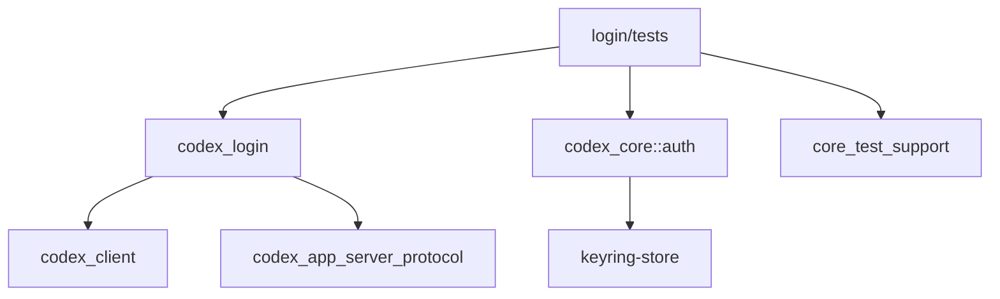

# Research: codex-rs/login/tests

## 概述

`codex-rs/login/tests` 目录包含 `codex-login` crate 的集成测试套件。这些测试覆盖了 Codex CLI 的两种主要登录方式：**设备码登录**（Device Code Login）和 **浏览器 OAuth 登录**（Browser-based Login）。测试使用模拟服务器（Mock Server）来模拟 OpenAI 认证服务，确保登录流程在各种场景下的正确性。

---

## 场景与职责

### 核心场景

该测试目录服务于以下验证目标：

1. **设备码登录流程验证**：测试无需浏览器的命令行登录方式，适用于 SSH/无图形界面环境
2. **浏览器 OAuth 登录验证**：测试本地回调服务器处理 OAuth 回调的完整流程
3. **错误处理验证**：确保各种失败场景（网络错误、权限拒绝、Workspace 不匹配）得到正确处理
4. **认证状态持久化验证**：验证登录成功后 `auth.json` 文件的正确写入

### 职责定位

| 职责 | 说明 |
|------|------|
| **集成测试** | 测试登录 crate 与外部依赖（core、client、app-server-protocol）的集成 |
| **Mock 测试** | 使用 WireMock 和 tiny_http 模拟 OAuth 服务器，避免依赖真实网络服务 |
| **E2E 场景覆盖** | 从用户操作到文件持久化的端到端验证 |
| **安全边界测试** | 验证 Workspace 限制、权限检查等安全机制 |

---

## 功能点目的

### 1. 设备码登录测试 (`device_code_login.rs`)

**文件路径**: `codex-rs/login/tests/suite/device_code_login.rs` (318 行)

**测试用例清单**：

| 测试函数 | 行号 | 目的 |
|---------|------|------|
| `device_code_login_integration_succeeds` | 116-152 | 验证完整登录流程成功，包括 token 持久化 |
| `device_code_login_rejects_workspace_mismatch` | 154-190 | 验证强制 Workspace ID 不匹配时拒绝登录 |
| `device_code_login_integration_handles_usercode_http_failure` | 192-221 | 验证 `/deviceauth/usercode` 端点失败处理 |
| `device_code_login_integration_persists_without_api_key_on_exchange_failure` | 223-264 | 验证无 API key 时仍持久化 tokens |
| `device_code_login_integration_handles_error_payload` | 266-318 | 验证授权拒绝错误（401 + error payload）处理 |

**Mock 辅助函数**：

- `make_jwt()` (26-32): 生成测试用 JWT token（无签名）
- `mock_usercode_success()` (34-45): 模拟 usercode 请求成功
- `mock_usercode_failure()` (47-53): 模拟 usercode 请求失败
- `mock_poll_token_two_step()` (55-78): 模拟两步轮询（先失败再成功）
- `mock_poll_token_single()` (80-86): 模拟单次 token 轮询
- `mock_oauth_token_single()` (88-98): 模拟 OAuth token 交换
- `server_opts()` (100-114): 构建测试用的 ServerOptions

### 2. 登录服务器 E2E 测试 (`login_server_e2e.rs`)

**文件路径**: `codex-rs/login/tests/suite/login_server_e2e.rs` (464 行)

**测试用例清单**：

| 测试函数 | 行号 | 目的 |
|---------|------|------|
| `end_to_end_login_flow_persists_auth_json` | 81-157 | 验证完整 OAuth 流程，包括覆盖旧 auth.json |
| `creates_missing_codex_home_dir` | 159-199 | 验证自动创建缺失的 codex_home 目录 |
| `forced_chatgpt_workspace_id_mismatch_blocks_login` | 201-256 | 验证 Workspace ID 强制检查失败场景 |
| `oauth_access_denied_missing_entitlement_blocks_login_with_clear_error` | 258-323 | 验证缺失 Codex 授权的错误页面文案 |
| `oauth_access_denied_unknown_reason_uses_generic_error_page` | 325-402 | 验证通用 OAuth 拒绝错误处理 |
| `cancels_previous_login_server_when_port_is_in_use` | 404-464 | 验证端口占用时取消旧服务器机制 |

**Mock 服务器实现**：

- `start_mock_issuer()` (18-79): 使用 tiny_http 启动模拟 OAuth 服务器
  - 处理 `/oauth/token` 端点
  - 返回包含 `chatgpt_plan_type=pro` 的 JWT
  - 在独立线程中运行

### 3. 测试聚合入口

**文件**: `codex-rs/login/tests/all.rs` (3 行)

```rust
// Single integration test binary that aggregates all test modules.
// The submodules live in `tests/suite/`.
mod suite;
```

**文件**: `codex-rs/login/tests/suite/mod.rs` (3 行)

```rust
// Aggregates all former standalone integration tests as modules.
mod device_code_login;
mod login_server_e2e;
```

---

## 具体技术实现

### 测试框架与工具链

```rust
// Cargo.toml dev-dependencies
[dev-dependencies]
anyhow = { workspace = true }
core_test_support = { workspace = true }
pretty_assertions = { workspace = true }
tempfile = { workspace = true }
wiremock = { workspace = true }
```

### 网络跳过机制

所有测试使用 `skip_if_no_network!` 宏，在沙箱网络禁用时自动跳过：

```rust
#[tokio::test]
async fn device_code_login_integration_succeeds() -> anyhow::Result<()> {
    skip_if_no_network!(Ok(()));
    // ... 测试逻辑
}
```

**宏定义位置**: `codex-rs/core/tests/common/lib.rs` (460-478)

```rust
#[macro_export]
macro_rules! skip_if_no_network {
    ($return_value:expr $(,)?) => {{
        if ::std::env::var($crate::sandbox_network_env_var()).is_ok() {
            println!(
                "Skipping test because it cannot execute when network is disabled in a Codex sandbox."
            );
            return $return_value;
        }
    }};
}
```

### WireMock 使用模式

```rust
// 1. 启动 MockServer
let mock_server = MockServer::start().await;

// 2. 配置 Mock 响应
Mock::given(method("POST"))
    .and(path("/api/accounts/deviceauth/usercode"))
    .respond_with(ResponseTemplate::new(200).set_body_json(json!({
        "device_auth_id": "device-auth-123",
        "user_code": "CODE-12345",
        "interval": "0"
    })))
    .mount(&mock_server)
    .await;

// 3. 使用 mock_server.uri() 作为 issuer
let issuer = mock_server.uri();
let opts = server_opts(&codex_home, issuer, AuthCredentialsStoreMode::File);

// 4. 执行测试
run_device_code_login(opts).await?;
```

### JWT 生成辅助函数

```rust
fn make_jwt(payload: serde_json::Value) -> String {
    let header = json!({ "alg": "none", "typ": "JWT" });
    let header_b64 = URL_SAFE_NO_PAD.encode(serde_json::to_vec(&header).unwrap());
    let payload_b64 = URL_SAFE_NO_PAD.encode(serde_json::to_vec(&payload).unwrap());
    let signature_b64 = URL_SAFE_NO_PAD.encode(b"sig");
    format!("{header_b64}.{payload_b64}.{signature_b64}")
}
```

### 认证状态验证模式

```rust
// 验证 auth.json 被正确写入
let auth = load_auth_dot_json(codex_home.path(), AuthCredentialsStoreMode::File)
    .context("auth.json should load after login succeeds")?
    .context("auth.json written")?;

// 验证 token 字段
let tokens = auth.tokens.expect("tokens persisted");
assert_eq!(tokens.access_token, "access-token-123");
assert_eq!(tokens.refresh_token, "refresh-token-123");
assert_eq!(tokens.id_token.raw_jwt, jwt);
assert_eq!(tokens.account_id.as_deref(), Some("acct_321"));
```

### tiny_http Mock 服务器模式

```rust
fn start_mock_issuer(chatgpt_account_id: &str) -> (SocketAddr, thread::JoinHandle<()>) {
    let listener = TcpListener::bind(("127.0.0.1", 0)).unwrap();
    let addr = listener.local_addr().unwrap();
    let server = tiny_http::Server::from_listener(listener, None).unwrap();
    
    let handle = thread::spawn(move || {
        while let Ok(mut req) = server.recv() {
            let url = req.url().to_string();
            if url.starts_with("/oauth/token") {
                // 构建 JWT 响应
                let id_token = format!("{}.{}.{}", b64(&header_bytes), b64(&payload_bytes), b64(b"sig"));
                let tokens = serde_json::json!({
                    "id_token": id_token,
                    "access_token": "access-123",
                    "refresh_token": "refresh-123",
                });
                let _ = req.respond(resp);
            }
        }
    });
    
    (addr, handle)
}
```

---

## 关键代码路径与文件引用

### 被测试的源文件

```
codex-rs/login/src/
├── lib.rs                    # 模块导出
├── device_code_auth.rs       # 设备码登录实现（被 device_code_login.rs 测试）
├── server.rs                 # OAuth 回调服务器（被 login_server_e2e.rs 测试）
├── pkce.rs                   # PKCE 码生成
└── assets/                   # HTML 模板文件
    ├── success.html
    └── error.html
```

### 测试文件结构

```
codex-rs/login/tests/
├── all.rs                    # 测试入口（聚合 suite 模块）
└── suite/
    ├── mod.rs                # 子模块聚合
    ├── device_code_login.rs  # 设备码登录测试（5 个测试用例）
    └── login_server_e2e.rs   # 登录服务器 E2E 测试（6 个测试用例）
```

### 关键依赖 crate

| Crate | 用途 |
|-------|------|
| `codex_core` | `AuthCredentialsStoreMode`, `load_auth_dot_json`, `save_auth` |
| `codex_login` | `ServerOptions`, `run_device_code_login`, `run_login_server` |
| `core_test_support` | `skip_if_no_network!` 宏 |
| `wiremock` | HTTP Mock 服务器（设备码测试） |
| `tiny_http` | 轻量级 HTTP 服务器（E2E 测试） |
| `tempfile` | 临时目录管理 |

---

## 依赖与外部交互

### 内部依赖



### 外部交互（Mock 层）

| 交互端点 | 用途 | Mock 工具 |
|---------|------|----------|
| `POST /api/accounts/deviceauth/usercode` | 请求设备码 | WireMock |
| `POST /api/accounts/deviceauth/token` | 轮询授权码 | WireMock |
| `POST /oauth/token` | 交换 token | WireMock / tiny_http |
| `GET /auth/callback` | OAuth 回调 | 真实请求到本地服务器 |
| `GET /success` | 成功页面 | 本地服务器响应 |
| `GET /cancel` | 取消登录 | 本地服务器响应 |

### 环境变量依赖

| 变量 | 用途 |
|------|------|
| `CODEX_SANDBOX_NETWORK_DISABLED` | 网络禁用时跳过测试 |
| `INSTA_WORKSPACE_ROOT` | 快照测试工作区根目录（由 core_test_support 设置） |

---

## 风险、边界与改进建议

### 当前风险

1. **测试依赖网络环境**
   - 风险：`skip_if_no_network!` 导致沙箱环境中测试被跳过，可能遗漏回归问题
   - 缓解：CI 环境确保网络可用，测试覆盖率由非沙箱运行保证

2. **Mock 服务器与真实服务差异**
   - 风险：WireMock/tiny_http 行为可能与真实 OpenAI 服务存在差异
   - 现状：测试覆盖主要成功/失败路径，但无法覆盖所有边缘情况

3. **时序敏感测试**
   - 风险：`cancels_previous_login_server_when_port_is_in_use` 依赖 100ms 睡眠
   - 位置：`login_server_e2e.rs:429`
   - 缓解：使用多线程运行时 (`flavor = "multi_thread"`)

4. **JWT 硬编码算法**
   - 风险：测试使用 `"alg": "none"` 的 JWT，与生产环境不同
   - 现状：仅用于测试 token 解析逻辑，不验证签名

### 边界情况

| 场景 | 测试覆盖 |
|------|---------|
| 端口占用自动取消旧服务器 | `cancels_previous_login_server_when_port_is_in_use` |
| 缺失 codex_home 目录自动创建 | `creates_missing_codex_home_dir` |
| Workspace ID 强制匹配失败 | `forced_chatgpt_workspace_id_mismatch_blocks_login` |
| 授权被拒绝（缺失 entitlement） | `oauth_access_denied_missing_entitlement_blocks_login_with_clear_error` |
| 授权被拒绝（未知原因） | `oauth_access_denied_unknown_reason_uses_generic_error_page` |
| 轮询端点 404 后重试 | `mock_poll_token_two_step` 辅助函数 |

### 改进建议

1. **增强测试覆盖率**
   - 添加测试：PKCE 码验证失败场景
   - 添加测试：token 刷新流程
   - 添加测试：并发登录请求处理

2. **减少测试脆弱性**
   - 替换固定睡眠时间为条件等待（如 `tokio::time::timeout` + 轮询）
   - 使用端口 0 自动分配避免端口冲突

3. **模拟更真实的 JWT**
   - 使用真实 RSA 密钥对生成签名 JWT，验证完整 token 处理流程
   - 添加过期 token 测试场景

4. **分离单元测试与集成测试**
   - 当前所有测试都是集成测试，考虑为 `pkce.rs` 等模块添加单元测试

5. **测试文档化**
   - 为复杂测试用例添加更多注释说明测试意图
   - 添加测试架构图说明 Mock 交互流程

---

## 附录：测试运行命令

```bash
# 运行所有登录测试
cd codex-rs && cargo test -p codex-login

# 运行特定测试
cargo test -p codex-login device_code_login_integration_succeeds

# 运行 E2E 测试
cargo test -p codex-login --test all login_server_e2e

# 查看测试输出
cargo test -p codex-login -- --nocapture
```

---

## 附录：相关文件索引

| 文件 | 行数 | 说明 |
|------|------|------|
| `codex-rs/login/tests/all.rs` | 3 | 测试入口 |
| `codex-rs/login/tests/suite/mod.rs` | 3 | 子模块聚合 |
| `codex-rs/login/tests/suite/device_code_login.rs` | 318 | 设备码登录测试 |
| `codex-rs/login/tests/suite/login_server_e2e.rs` | 464 | 登录服务器 E2E 测试 |
| `codex-rs/login/src/device_code_auth.rs` | 228 | 被测试的设备码实现 |
| `codex-rs/login/src/server.rs` | 1195 | 被测试的登录服务器实现 |
| `codex-rs/core/tests/common/lib.rs` | 524 | 测试支持库（skip_if_no_network） |
