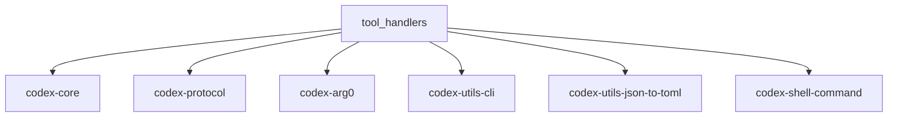

# DIR Research: codex-rs/mcp-server/src/tool_handlers

## 场景与职责

`tool_handlers` 目录是 Codex MCP (Model Context Protocol) 服务器的核心组件之一，负责处理 MCP 工具调用的具体逻辑。该目录虽然结构简单（仅包含 `mod.rs`），但承载了整个 MCP 服务器与 Codex 核心能力之间的桥接职责。

### 核心场景

1. **MCP 工具暴露**: 将 Codex 的核心能力（启动对话、发送消息）暴露为 MCP 协议的工具接口
2. **多轮对话支持**: 支持通过 `codex` 和 `codex-reply` 两个工具实现对话的启动和延续
3. **异步会话管理**: 在独立的 Tokio 任务中运行 Codex 会话，避免阻塞主消息处理循环

### 架构定位

```
┌─────────────────────────────────────────────────────────────────┐
│                    MCP Client (e.g., Claude Desktop)             │
└─────────────────────────────────────────────────────────────────┘
                              │
                              ▼ JSON-RPC over stdio
┌─────────────────────────────────────────────────────────────────┐
│                    codex-mcp-server                              │
│  ┌─────────────────┐    ┌──────────────────┐    ┌─────────────┐ │
│  │  stdin_reader   │───▶│ message_processor│───▶│ tool_handlers│ │
│  └─────────────────┘    └──────────────────┘    └─────────────┘ │
│                              │                          │       │
│                              ▼                          ▼       │
│  ┌─────────────────┐    ┌──────────────────┐    ┌─────────────┐ │
│  │  stdout_writer  │◀───│ outgoing_message │◀───│codex_tool_  │ │
│  └─────────────────┘    └──────────────────┘    │runner       │ │
│                                                  └─────────────┘ │
└─────────────────────────────────────────────────────────────────┘
                              │
                              ▼
┌─────────────────────────────────────────────────────────────────┐
│                    Codex Core (ThreadManager)                    │
└─────────────────────────────────────────────────────────────────┘
```

## 功能点目的

### 1. 模块导出 (`mod.rs`)

**文件**: `codex-rs/mcp-server/src/tool_handlers/mod.rs`

该模块文件仅导出两个子模块：
- `create_conversation`: 创建新对话的工具处理
- `send_message`: 向现有对话发送消息的工具处理

**注意**: 当前代码中这两个模块被声明但未在目录中提供实际实现文件，实际功能由 `message_processor.rs` 直接处理。

### 2. 工具定义与配置 (`codex_tool_config.rs`)

**文件**: `codex-rs/mcp-server/src/codex_tool_config.rs`

定义了两个核心 MCP 工具的参数结构：

#### `CodexToolCallParam` - `codex` 工具的参数

| 字段 | 类型 | 说明 |
|------|------|------|
| `prompt` | `String` | 初始用户提示（必需） |
| `model` | `Option<String>` | 模型名称覆盖 |
| `profile` | `Option<String>` | 配置 profile |
| `cwd` | `Option<String>` | 工作目录 |
| `approval_policy` | `Option<CodexToolCallApprovalPolicy>` | 命令审批策略 |
| `sandbox` | `Option<CodexToolCallSandboxMode>` | 沙箱模式 |
| `config` | `Option<HashMap<String, Value>>` | 额外配置覆盖 |
| `base_instructions` | `Option<String>` | 基础指令覆盖 |
| `developer_instructions` | `Option<String>` | 开发者指令 |
| `compact_prompt` | `Option<String>` | 压缩提示词 |

#### `CodexToolCallReplyParam` - `codex-reply` 工具的参数

| 字段 | 类型 | 说明 |
|------|------|------|
| `conversation_id` | `Option<String>` | 已废弃，使用 thread_id |
| `thread_id` | `Option<String>` | 对话线程 ID |
| `prompt` | `String` | 后续用户提示 |

### 3. 工具运行器 (`codex_tool_runner.rs`)

**文件**: `codex-rs/mcp-server/src/codex_tool_runner.rs`

提供异步执行 Codex 会话的核心功能：

#### 主要函数

| 函数 | 职责 |
|------|------|
| `run_codex_tool_session` | 启动新的 Codex 会话，处理初始提示 |
| `run_codex_tool_session_reply` | 在现有会话上继续对话 |
| `run_codex_tool_session_inner` | 核心事件循环，处理会话事件流 |
| `create_call_tool_result_with_thread_id` | 构建符合 MCP 规范的响应 |

### 4. 执行审批处理 (`exec_approval.rs`)

**文件**: `codex-rs/mcp-server/src/exec_approval.rs`

处理 shell 命令执行的审批流程：

- 当 Codex 需要执行 shell 命令时，向 MCP 客户端发送 `elicitation/create` 请求
- 等待用户响应（批准/拒绝）
- 将决策提交回 Codex 核心

### 5. 补丁审批处理 (`patch_approval.rs`)

**文件**: `codex-rs/mcp-server/src/patch_approval.rs`

处理代码补丁应用的审批流程：

- 当 Codex 需要应用代码变更时，向 MCP 客户端发送审批请求
- 包含变更详情（文件路径、diff 内容）
- 等待用户响应并提交决策

## 具体技术实现

### 关键流程

#### 1. 工具调用处理流程

```rust
// message_processor.rs: handle_call_tool
match name.as_ref() {
    "codex" => self.handle_tool_call_codex(id, arguments).await,
    "codex-reply" => self.handle_tool_call_codex_session_reply(id, arguments).await,
    _ => { /* 未知工具错误 */ }
}
```

#### 2. 新会话启动流程

```rust
// 1. 解析参数
let (initial_prompt, config) = match serde_json::from_value::<CodexToolCallParam>(json_val) {
    Ok(tool_cfg) => tool_cfg.into_config(self.arg0_paths.clone()).await?,
    Err(e) => { /* 返回错误 */ }
};

// 2. 在独立任务中运行会话
tokio::spawn(async move {
    crate::codex_tool_runner::run_codex_tool_session(
        id, initial_prompt, config, outgoing, thread_manager, running_requests_id_to_codex_uuid
    ).await;
});
```

#### 3. 事件处理循环

```rust
// codex_tool_runner.rs: run_codex_tool_session_inner
loop {
    match thread.next_event().await {
        Ok(event) => {
            // 发送事件作为通知
            outgoing.send_event_as_notification(&event, meta).await;
            
            match event.msg {
                EventMsg::ExecApprovalRequest(ev) => {
                    handle_exec_approval_request(...).await;
                }
                EventMsg::ApplyPatchApprovalRequest(ev) => {
                    handle_patch_approval_request(...).await;
                }
                EventMsg::TurnComplete(ev) => {
                    // 返回最终结果
                    outgoing.send_response(id, result).await;
                    break;
                }
                EventMsg::Error(err) => {
                    // 返回错误
                    outgoing.send_response(id, error_result).await;
                    break;
                }
                // ... 其他事件类型
            }
        }
        Err(e) => { /* 处理错误 */ }
    }
}
```

### 数据结构

#### 审批策略枚举

```rust
#[derive(Debug, Clone, Serialize, Deserialize, JsonSchema, PartialEq)]
#[serde(rename_all = "kebab-case")]
pub enum CodexToolCallApprovalPolicy {
    Untrusted,   // 除非在信任列表，否则需要审批
    OnFailure,   // 失败时需要审批
    OnRequest,   // 按需审批
    Never,       // 从不审批
}
```

#### 沙箱模式枚举

```rust
#[derive(Debug, Clone, Serialize, Deserialize, JsonSchema, PartialEq)]
#[serde(rename_all = "kebab-case")]
pub enum CodexToolCallSandboxMode {
    ReadOnly,         // 只读
    WorkspaceWrite,   // 工作区可写
    DangerFullAccess, // 完全访问（危险）
}
```

### 协议与命令

#### MCP 工具列表响应

服务器暴露两个工具：

1. **`codex`** - 启动新对话
   - 输入: `CodexToolCallParam` JSON Schema
   - 输出: `{ threadId: string, content: string }`

2. **`codex-reply`** - 继续现有对话
   - 输入: `CodexToolCallReplyParam` JSON Schema
   - 输出: `{ threadId: string, content: string }`

#### Elicitation 请求格式

执行审批请求 (`elicitation/create`)：

```json
{
  "message": "Allow Codex to run `git status` in `/home/user/project`?",
  "requestedSchema": {"type": "object", "properties": {}},
  "threadId": "uuid",
  "codexElicitation": "exec-approval",
  "codexMcpToolCallId": "...",
  "codexEventId": "...",
  "codexCallId": "...",
  "codexCommand": ["git", "status"],
  "codexCwd": "/home/user/project",
  "codexParsedCmd": [...]
}
```

补丁审批请求：

```json
{
  "message": "Allow Codex to apply proposed code changes?",
  "requestedSchema": {"type": "object", "properties": {}},
  "threadId": "uuid",
  "codexElicitation": "patch-approval",
  "codexChanges": {
    "/path/to/file": {
      "type": "Update",
      "unifiedDiff": "...",
      "movePath": null
    }
  }
}
```

## 关键代码路径与文件引用

### 核心文件

| 文件 | 职责 | 关键行数 |
|------|------|----------|
| `tool_handlers/mod.rs` | 模块导出 | 2 |
| `codex_tool_config.rs` | 工具参数定义、JSON Schema 生成 | 433 |
| `codex_tool_runner.rs` | 异步会话执行、事件循环 | 434 |
| `exec_approval.rs` | 命令执行审批处理 | 147 |
| `patch_approval.rs` | 补丁应用审批处理 | 142 |
| `message_processor.rs` | MCP 消息处理、工具调用分发 | 603 |
| `outgoing_message.rs` | 消息发送、通知管理 | 472 |

### 调用链

```
main.rs
  └── run_main()
      └── MessageProcessor::new()
          └── handle_call_tool() [message_processor.rs:328]
              ├── handle_tool_call_codex() [message_processor.rs:352]
              │   └── codex_tool_runner::run_codex_tool_session()
              │       ├── thread_manager.start_thread()
              │       └── run_codex_tool_session_inner()
              │           ├── handle_exec_approval_request() [exec_approval.rs:51]
              │           └── handle_patch_approval_request() [patch_approval.rs:44]
              └── handle_tool_call_codex_session_reply()
                  └── codex_tool_runner::run_codex_tool_session_reply()
```

### 测试文件

| 文件 | 测试内容 |
|------|----------|
| `tests/suite/codex_tool.rs` | 集成测试：shell 命令审批、补丁审批、基础指令传递 |
| `tests/common/mcp_process.rs` | MCP 进程测试辅助 |
| `tests/common/responses.rs` | Mock SSE 响应生成 |

## 依赖与外部交互

### 内部依赖



### 外部依赖

| Crate | 用途 |
|-------|------|
| `rmcp` | MCP 协议实现（JSON-RPC、工具定义） |
| `schemars` | JSON Schema 生成 |
| `serde`/`serde_json` | 序列化/反序列化 |
| `tokio` | 异步运行时 |
| `tracing` | 日志记录 |
| `shlex` | Shell 命令转义 |

### 核心类型依赖

```rust
// 来自 codex-core
use codex_core::ThreadManager;
use codex_core::CodexThread;
use codex_core::config::Config;
use codex_core::AuthManager;

// 来自 codex-protocol
use codex_protocol::ThreadId;
use codex_protocol::protocol::{Event, EventMsg, Op, Submission};
use codex_protocol::protocol::{ExecApprovalRequestEvent, ApplyPatchApprovalRequestEvent};
use codex_protocol::protocol::ReviewDecision;

// 来自 rmcp
use rmcp::model::{CallToolRequestParams, CallToolResult, Tool};
use rmcp::model::{RequestId, ErrorData};
```

## 风险、边界与改进建议

### 当前风险

1. **未实现的模块声明**
   - `tool_handlers/mod.rs` 声明了 `create_conversation` 和 `send_message` 子模块，但实际文件不存在
   - 实际功能分散在 `message_processor.rs` 和 `codex_tool_*.rs` 中
   - **建议**: 统一模块结构，或移除未实现的声明

2. **错误处理一致性**
   - 部分错误使用 `tracing::error!` 记录，部分直接返回
   - JSON 序列化错误处理使用 `#[expect(clippy::expect_used)]`
   - **建议**: 统一错误处理策略，避免 panic

3. **并发安全**
   - `running_requests_id_to_codex_uuid` 使用 `Arc<Mutex<HashMap<...>>>`
   - 锁持有时间较长可能阻塞其他请求
   - **建议**: 考虑使用 `tokio::sync::RwLock` 或分片锁

4. **会话生命周期管理**
   - 会话取消时可能遗留资源
   - `CancelledNotification` 处理需要遍历查找映射
   - **建议**: 添加超时清理机制

### 边界情况

1. **参数验证**
   - `codex-reply` 工具接受 `conversation_id` 或 `thread_id`，但两者都为空时会报错
   - 路径参数未验证是否存在或可访问

2. **事件处理**
   - 大量事件类型被标记为 `TODO` 或未处理（如 `AgentMessageDelta`, `AgentReasoningDelta`）
   - 这些事件当前仅作为通知发送，不影响工具调用结果

3. **审批超时**
   - 当前没有内置的审批超时机制
   - 用户不响应时会话将一直挂起

### 改进建议

1. **代码组织**
   ```
   tool_handlers/
   ├── mod.rs              # 仅保留模块导出
   ├── codex.rs            # codex 工具处理（从 message_processor 迁移）
   ├── codex_reply.rs      # codex-reply 工具处理
   └── common.rs           # 共享逻辑
   ```

2. **配置验证**
   - 在 `into_config()` 中添加更多验证逻辑
   - 提前发现无效的工作目录或模型名称

3. **可观测性**
   - 添加更多 `tracing::span` 用于跟踪请求生命周期
   - 暴露会话指标（活跃会话数、平均响应时间）

4. **测试覆盖**
   - 当前集成测试依赖网络（MockServer）
   - 建议添加纯单元测试，模拟 `ThreadManager` 和 `CodexThread`

5. **文档完善**
   - 添加架构图说明组件关系
   - 记录工具参数的具体约束和默认值

---

*研究日期: 2026-03-21*
*研究员: Kimi Code CLI*
