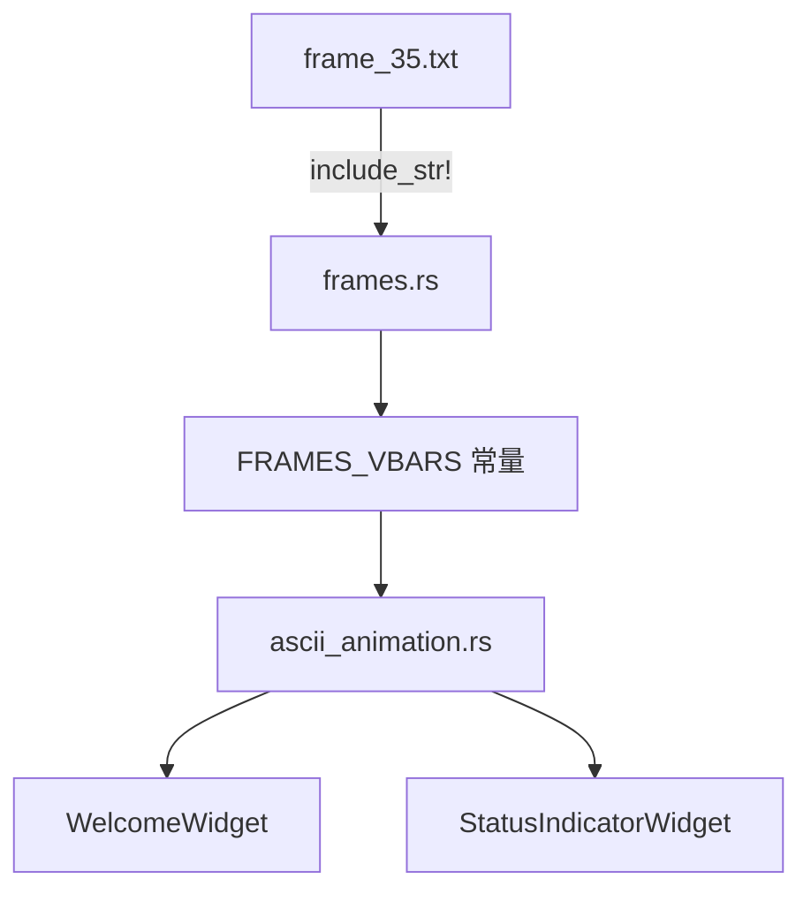

# frame_35.txt 研究文档

## 场景与职责

`frame_35.txt` 是 Codex TUI（终端用户界面）ASCII 动画系统的关键帧文件，属于 `vbars`（垂直条形）动画变体的第 35 帧。作为 36 帧循环动画序列中的倒数第 2 帧，它在以下场景中承担重要职责：

### 核心使用场景

1. **欢迎界面动态背景** (`WelcomeWidget`)
   - 新用户首次启动 Codex CLI 时的视觉欢迎体验
   - 通过 `Ctrl+.` 快捷键可随机切换到此变体
   - 在 60×37 字符以上的视口中显示

2. **任务状态实时反馈** (`StatusIndicatorWidget`)
   - 配合 "Working" 等状态文字
   - 与 shimmer 效果结合提供动态视觉反馈
   - 每 32ms 调度一次帧更新（约 31 FPS）

3. **命令执行指示** (`ExecCell`)
   - 作为 `spinner()` 函数的替代视觉元素
   - 在命令执行期间提供持续的活动指示

## 功能点目的

### 动画变体定位
`vbars` 是 10 个内置动画变体之一：
```rust
// frames.rs:58-69
pub(crate) const ALL_VARIANTS: &[&[&str]] = &[
    &FRAMES_DEFAULT,   // 索引 0
    &FRAMES_CODEX,     // 索引 1
    &FRAMES_OPENAI,    // 索引 2
    &FRAMES_BLOCKS,    // 索引 3
    &FRAMES_DOTS,      // 索引 4
    &FRAMES_HASH,      // 索引 5
    &FRAMES_HBARS,     // 索引 6
    &FRAMES_VBARS,     // 索引 7 ← vbars 变体
    &FRAMES_SHAPES,    // 索引 8
    &FRAMES_SLUG,      // 索引 9
];
```

### 第 35 帧的时间特性
- **循环位置**: 35/36 = 97.2%，即将完成一个完整周期
- **显示时机**: 动画启动后约 2.72 秒至 2.80 秒之间
- **下一帧**: frame_36（最后一帧），然后循环回 frame_1

### 视觉设计意图
第 35 帧的图案设计体现：
- **过渡状态**: 为循环回到起始帧做准备
- **视觉节奏**: 与前后帧形成连贯的"呼吸"或"脉动"效果
- **密度分布**: 特定的字符密度模式创造独特的视觉纹理

## 具体技术实现

### 文件结构分析
```
frame_35.txt
├── 第 1 行: 空行（顶部边距）
├── 第 2-16 行: ASCII 艺术主体（15 行）
│   ├── 左右边距空格
│   ├── 中心图案区域（垂直条形）
│   └── 内部负空间
└── 第 17 行: 空行（底部边距）
```

### 字符使用详情
该帧使用的 Unicode 方块字符：

| 字符 | Unicode | 视觉密度 | 用途 |
|-----|---------|---------|------|
| `█` | U+2588 | 100% | 核心高密度区域 |
| `▉` | U+2589 | 87.5% | 高密度过渡 |
| `▊` | U+258A | 75% | 中高区域 |
| `▋` | U+258B | 62.5% | 中密度区域 |
| `▌` | U+258C | 50% | 中等过渡 |
| `▍` | U+258D | 37.5% | 中低区域 |
| `▎` | U+258E | 25% | 低密度过渡 |
| `▏` | U+258F | 12.5% | 细微填充/边缘 |
| ` ` | U+0020 | 0% | 负空间/背景 |

### 编译时嵌入机制

#### 宏展开过程
```rust
// 源代码（frames.rs:54）
pub(crate) const FRAMES_VBARS: [&str; 36] = frames_for!("vbars");

// 宏展开后（概念表示）
pub(crate) const FRAMES_VBARS: [&str; 36] = [
    include_str!("../frames/vbars/frame_1.txt"),
    // ... 第 2-34 帧 ...
    include_str!("../frames/vbars/frame_35.txt"),  // 索引 34
    include_str!("../frames/vbars/frame_36.txt"),  // 索引 35
];

// 编译后（二进制布局）
// .rodata 段:
// frame_35_data: [字节序列，UTF-8 编码]
// FRAMES_VBARS: [指针数组，指向各帧数据]
```

### 运行时访问流程

```
┌─────────────────────────────────────────────────────────────┐
│ 1. 时间计算                                                  │
│    elapsed = Instant::now() - animation_start               │
│    elapsed_ms = elapsed.as_millis()                         │
│                                                             │
│ 2. 帧索引计算                                                │
│    tick_ms = 80                                             │
│    frame_index = (elapsed_ms / tick_ms) % 36                │
│    // 当 elapsed_ms ∈ [2720, 2800) 时，frame_index = 34      │
│                                                             │
│ 3. 帧数据获取                                                │
│    frame_data = FRAMES_VBARS[34]  // frame_35.txt 内容      │
│                                                             │
│ 4. 渲染处理                                                  │
│    lines = frame_data.lines().map(Into::into)               │
│    Paragraph::new(lines).render(area, buf)                  │
└─────────────────────────────────────────────────────────────┘
```

### 帧调度系统

#### FrameRequester 使用
```rust
// ascii_animation.rs:44-62
pub(crate) fn schedule_next_frame(&self) {
    let tick_ms = self.frame_tick.as_millis();  // 80ms
    let elapsed_ms = self.start.elapsed().as_millis();
    let rem_ms = elapsed_ms % tick_ms;
    let delay_ms = if rem_ms == 0 { tick_ms } else { tick_ms - rem_ms };
    
    // 调度下一帧在 80ms 内渲染
    self.request_frame
        .schedule_frame_in(Duration::from_millis(delay_ms as u64));
}
```

#### 与 120 FPS 限制的关系
```rust
// frame_rate_limiter.rs
pub const MIN_FRAME_INTERVAL: Duration = Duration::from_millis(8);  // ~120 FPS

// 动画实际帧率: 1000ms / 80ms = 12.5 FPS
// 远低于 120 FPS 限制，不会触发限流
```

## 关键代码路径与文件引用

### 核心代码路径

| 路径 | 行号范围 | 功能描述 |
|-----|---------|---------|
| `codex-rs/tui/frames/vbars/frame_35.txt` | 1-17 | 本文件，ASCII 艺术数据 |
| `codex-rs/tui/src/frames.rs` | 1-71 | 帧数据嵌入宏和常量定义 |
| `codex-rs/tui/src/ascii_animation.rs` | 1-111 | 动画状态机和帧管理 |
| `codex-rs/tui/src/tui/frame_requester.rs` | 1-354 | 帧调度系统 |
| `codex-rs/tui/src/onboarding/welcome.rs` | 1-170 | 欢迎界面使用动画 |
| `codex-rs/tui/src/status_indicator_widget.rs` | 1-440 | 状态指示器 |

### 调用链详细分析

#### 链 A: 欢迎界面渲染
```
welcome.rs:68 render_ref()
    ├── welcome.rs:71 schedule_next_frame() [如果动画启用]
    ├── ascii_animation.rs:44 schedule_next_frame()
    │   └── frame_requester.rs:54 schedule_frame_in()
    │       └── 发送 Instant 到 FrameScheduler
    │
    ├── welcome.rs:82 current_frame()
    │   └── ascii_animation.rs:65 current_frame()
    │       └── 计算 idx = (elapsed / 80) % 36
    │       └── 返回 FRAMES_VBARS[idx]（可能是 frame_35）
    │
    └── welcome.rs:83 lines.extend(frame.lines())
        └── 使用 ratatui 渲染到 Buffer
```

#### 链 B: 变体随机切换
```
用户输入: Ctrl+.
    │
    ▼
welcome.rs:34 handle_key_event()
    ├── 检查: KeyCode::Char('.') + KeyModifiers::CONTROL
    │
    └── welcome.rs:43 pick_random_variant()
        └── ascii_animation.rs:79 pick_random_variant()
            ├── rand::rng().random_range(0..10)  // 10 个变体
            ├── 确保新变体 ≠ 当前变体
            │   // 可能选中索引 7 (FRAMES_VBARS)
            │
            └── request_frame.schedule_frame()  // 立即刷新
```

## 依赖与外部交互

### 编译依赖



### 运行时依赖

| 组件 | 用途 | 版本要求 |
|-----|------|---------|
| ratatui | UI 渲染 | 0.24+ |
| crossterm | 终端控制 | 0.27+ |
| tokio | 异步调度 | 1.0+ |
| rand | 随机变体 | 0.8+ |

### 终端要求
- **编码**: UTF-8（必需）
- **字符集**: Unicode 方块字符（U+2580-U+259F）
- **宽度计算**: 正确处理双宽字符
- **颜色**: 256 色或真彩色（推荐，用于 shimmer 效果）

### 配置集成
```rust
// 影响 frame_35 显示的配置项
pub struct Config {
    pub animations: bool,  // 总开关
    // ... 其他配置
}

// 视口限制（welcome.rs）
const MIN_ANIMATION_HEIGHT: u16 = 37;  // 必须 >= 17（帧高度）+ 边距
const MIN_ANIMATION_WIDTH: u16 = 60;   // 必须 >= 帧宽度
```

## 风险、边界与改进建议

### 风险矩阵

| 风险 | 严重性 | 可能性 | 缓解策略 |
|-----|-------|-------|---------|
| 文件丢失导致编译失败 | 高 | 低 | Git 版本控制、CI 构建检查 |
| 编码变更导致乱码 | 高 | 低 | `.gitattributes` 强制 UTF-8 |
| 手动编辑破坏图案 | 中 | 中 | 快照测试、代码审查 |
| 终端不兼容显示异常 | 中 | 中 | 终端能力检测 |
| 二进制体积膨胀 | 低 | 高 | 当前可接受，长期考虑优化 |

### 边界条件

#### 时间边界
```rust
// 第 35 帧的精确时间窗口
const FRAME_35_INDEX: usize = 34;  // 0-indexed
const TICK_MS: u128 = 80;

// frame_35 显示的时间范围
let start_ms = FRAME_35_INDEX * TICK_MS;  // 2720ms
let end_ms = (FRAME_35_INDEX + 1) * TICK_MS;  // 2800ms

// 边界情况：当 elapsed_ms 恰好等于 2800ms 时
// idx = (2800 / 80) % 36 = 35 % 36 = 35
// 将显示 frame_36，而非 frame_35
```

#### 空间边界
```rust
// 帧尺寸
const FRAME_LINES: usize = 17;
const FRAME_WIDTH: usize = 40;  // 近似，实际因字符而异

// 渲染边界
if area.height >= MIN_ANIMATION_HEIGHT && area.width >= MIN_ANIMATION_WIDTH {
    // frame_35 可以完整显示
} else {
    // 跳过动画或截断显示
}
```

### 改进建议

#### 1. 自动化验证（立即实施）
```bash
#!/bin/bash
# check-frames.sh - 建议添加到 CI

ERRORS=0
for variant in codex-rs/tui/frames/*/; do
    for i in {1..36}; do
        file="${variant}frame_$i.txt"
        if [ ! -f "$file" ]; then
            echo "ERROR: Missing $file"
            ((ERRORS++))
            continue
        fi
        
        lines=$(wc -l < "$file")
        if [ "$lines" -ne 17 ]; then
            echo "ERROR: $file has $lines lines (expected 17)"
            ((ERRORS++))
        fi
    done
done

exit $ERRORS
```

#### 2. 程序化生成（长期）
考虑使用数学函数替代静态文件：
```rust
fn generate_vbars_frame(t: f32) -> String {
    let mut output = String::new();
    for row in 0..17 {
        for col in 0..40 {
            let height = calculate_bar_height(t, col);
            let char = density_char_for_height(row, height);
            output.push(char);
        }
        output.push('\n');
    }
    output
}
```

#### 3. 主题集成
```rust
// 与 TUI 主题系统联动
impl ThemedAnimation for AsciiAnimation {
    fn render_with_theme(&self, theme: &Theme) -> Vec<Line> {
        let frame = self.current_frame();
        frame.chars().map(|c| {
            let style = theme.style_for_density_char(c);
            Span::styled(c.to_string(), style)
        }).collect()
    }
}
```

#### 4. 性能优化
- **延迟加载**: 仅在首次访问变体时加载帧数据
- **压缩**: 使用字符串去重减少内存占用
- **缓存**: 缓存渲染结果避免重复处理

### 监控与遥测
建议添加的指标：
```rust
// 动画系统遥测
pub struct AnimationMetrics {
    pub variant_switches: Counter,      // 变体切换次数
    pub frames_rendered: Counter,       // 总渲染帧数
    pub skipped_due_to_viewport: Counter,  // 因视口小跳过次数
    pub avg_frame_render_time: Histogram,  // 平均渲染耗时
}
```
