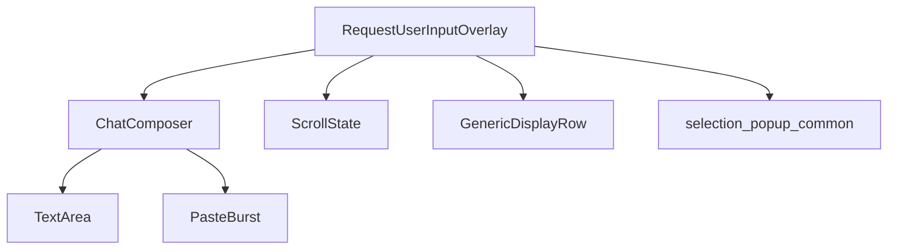

# Research: codex-rs/tui/src/bottom_pane/request_user_input/snapshots

## 1. 场景与职责

### 1.1 目录定位

`snapshots/` 目录位于 `codex-rs/tui/src/bottom_pane/request_user_input/` 下，是 **insta snapshot testing** 的产出目录，用于存储 `RequestUserInputOverlay` 组件的 UI 渲染快照。

### 1.2 核心职责

该目录存储了 12 个 `.snap` 文件，记录了 `RequestUserInputOverlay` 在不同状态下的终端渲染输出：

| 快照文件 | 测试场景 |
|---------|---------|
| `request_user_input_options.snap` | 基础选项选择界面 |
| `request_user_input_options_notes_visible.snap` | 选项选择 + Notes 输入框可见 |
| `request_user_input_notes_hidden.snap` | Notes 区域隐藏状态 |
| `request_user_input_freeform.snap` | 自由文本输入模式（无选项） |
| `request_user_input_multi_question_first.snap` | 多问题场景 - 第一个问题 |
| `request_user_input_multi_question_last.snap` | 多问题场景 - 最后一个问题 |
| `request_user_input_footer_wrap.snap` | 底部提示文本换行 |
| `request_user_input_scrolling_options.snap` | 选项滚动场景 |
| `request_user_input_hidden_options_footer.snap` | 选项被截断时的底部提示 |
| `request_user_input_long_option_text.snap` | 超长选项文本换行 |
| `request_user_input_wrapped_options.snap` | 选项文本自动换行 |
| `request_user_input_tight_height.snap` | 紧凑高度布局 |
| `request_user_input_unanswered_confirmation.snap` | 未回答问题确认对话框 |

### 1.3 业务场景

`RequestUserInputOverlay` 是 Codex TUI 的**用户输入请求覆盖层**，用于：

1. **Agent 向用户提问**：当 Agent 需要用户决策时（如选择下一步操作、确认配置等）
2. **多问题向导**：支持连续多个相关问题的分步回答
3. **选项选择 + 备注**：用户可选择预设选项，并添加额外备注说明
4. **自由文本输入**：无预设选项时的开放式输入
5. **敏感信息输入**：支持 `is_secret` 模式的密码输入（显示为掩码）

---

## 2. 功能点目的

### 2.1 Snapshot Testing 目的

```rust
// 典型测试代码（来自 mod.rs）
#[test]
fn request_user_input_options_snapshot() {
    let (tx, _rx) = test_sender();
    let overlay = RequestUserInputOverlay::new(
        request_event("turn-1", vec![question_with_options("q1", "Area")]),
        tx,
        true,
        false,
        false,
    );
    let area = Rect::new(0, 0, 120, 16);
    insta::assert_snapshot!(
        "request_user_input_options",
        render_snapshot(&overlay, area)
    );
}
```

**Snapshot 测试的核心价值**：

1. **UI 回归防护**：任何渲染逻辑的改动都会触发快照差异，防止意外视觉回归
2. **文档化 UI 状态**：快照文件本身就是 UI 状态的"黄金记录"
3. **跨平台一致性**：确保不同终端环境下的渲染输出一致
4. **代码审查辅助**：UI 变更通过 `.snap.new` 文件直观展示

### 2.2 覆盖的功能维度

| 维度 | 覆盖场景 |
|-----|---------|
| **布局** | 正常高度、紧凑高度、超长文本 |
| **交互状态** | 选项焦点、Notes 展开/收起、多问题导航 |
| **内容类型** | 短选项、长选项、自由文本、敏感输入 |
| **边界情况** | 底部提示换行、选项滚动、未回答确认 |

---

## 3. 具体技术实现

### 3.1 数据结构

#### 3.1.1 核心状态机（mod.rs）

```rust
pub(crate) struct RequestUserInputOverlay {
    app_event_tx: AppEventSender,
    request: RequestUserInputEvent,
    queue: VecDeque<RequestUserInputEvent>,  // 待处理的请求队列
    composer: ChatComposer,                   // 复用主输入框组件
    answers: Vec<AnswerState>,               // 每个问题的回答状态
    current_idx: usize,                       // 当前问题索引
    focus: Focus,                            // 焦点位置（Options/Notes）
    done: bool,
    pending_submission_draft: Option<ComposerDraft>,
    confirm_unanswered: Option<ScrollState>, // 未回答确认对话框状态
}

struct AnswerState {
    options_state: ScrollState,      // 选项滚动/选择状态
    draft: ComposerDraft,            // Notes 草稿
    answer_committed: bool,          // 是否已提交
    notes_visible: bool,             // Notes UI 是否可见
}

#[derive(Clone, Copy, Debug, PartialEq, Eq)]
enum Focus {
    Options,
    Notes,
}
```

#### 3.1.2 协议数据结构（protocol/src/request_user_input.rs）

```rust
#[derive(Debug, Clone, Deserialize, Serialize, PartialEq, Eq, JsonSchema, TS)]
pub struct RequestUserInputEvent {
    pub call_id: String,
    pub turn_id: String,
    pub questions: Vec<RequestUserInputQuestion>,
}

#[derive(Debug, Clone, Deserialize, Serialize, PartialEq, Eq, JsonSchema, TS)]
pub struct RequestUserInputQuestion {
    pub id: String,
    pub header: String,
    pub question: String,
    pub is_other: bool,      // 是否显示"None of the above"选项
    pub is_secret: bool,     // 是否密码输入（掩码显示）
    pub options: Option<Vec<RequestUserInputQuestionOption>>,
}

#[derive(Debug, Clone, Deserialize, Serialize, PartialEq, Eq, JsonSchema, TS)]
pub struct RequestUserInputQuestionOption {
    pub label: String,
    pub description: String,
}
```

### 3.2 关键流程

#### 3.2.1 初始化流程

```rust
impl RequestUserInputOverlay {
    pub(crate) fn new(
        request: RequestUserInputEvent,
        app_event_tx: AppEventSender,
        has_input_focus: bool,
        enhanced_keys_supported: bool,
        disable_paste_burst: bool,
    ) -> Self {
        // 1. 创建专用的 ChatComposer（禁用 popup/slash-command）
        let mut composer = ChatComposer::new_with_config(
            has_input_focus,
            app_event_tx.clone(),
            enhanced_keys_supported,
            ANSWER_PLACEHOLDER.to_string(),
            disable_paste_burst,
            ChatComposerConfig::plain_text(),
        );
        composer.set_footer_hint_override(Some(Vec::new()));
        
        // 2. 初始化 overlay 状态
        let mut overlay = Self { ... };
        overlay.reset_for_request();
        overlay.ensure_focus_available();
        overlay.restore_current_draft();
        overlay
    }
}
```

#### 3.2.2 键盘事件处理流程

```rust
fn handle_key_event(&mut self, key_event: KeyEvent) {
    // 1. 未回答确认对话框优先处理
    if self.confirm_unanswered_active() {
        self.handle_confirm_unanswered_key_event(key_event);
        return;
    }
    
    // 2. Esc 处理（清除 Notes 或中断）
    if matches!(key_event.code, KeyCode::Esc) { ... }
    
    // 3. 问题导航（Ctrl+P/N, 左右箭头, h/l）
    // ...
    
    // 4. 根据焦点分派
    match self.focus {
        Focus::Options => self.handle_options_key_event(key_event),
        Focus::Notes => self.handle_notes_key_event(key_event),
    }
}
```

#### 3.2.3 选项模式按键映射

| 按键 | 行为 |
|-----|------|
| `↑/↓` 或 `k/j` | 上下移动选择 |
| `←/→` 或 `h/l` | 切换到上/下一个问题 |
| `Space` | 确认当前选择 |
| `Enter` | 确认并进入下一问题/提交 |
| `Tab` | 展开 Notes 输入框 |
| `Backspace/Delete` | 清除选择 |
| `1-9` | 直接选择对应选项并提交 |

#### 3.2.4 Notes 模式按键映射

| 按键 | 行为 |
|-----|------|
| `Tab` | 清除 Notes 并返回选项 |
| `Backspace`（空内容时） | 清除 Notes 并返回选项 |
| `Enter` | 提交当前 Notes |
| `↑/↓` | 在 Notes 中仍可切换选项选择 |
| 普通字符 | 输入 Notes 内容 |

#### 3.2.5 提交流程

```rust
fn submit_answers(&mut self) {
    // 1. 构建答案映射
    let mut answers = HashMap::new();
    for (idx, question) in self.request.questions.iter().enumerate() {
        let answer_state = &self.answers[idx];
        
        // 获取选中的选项标签
        let selected_label = ...;
        
        // 获取 Notes 内容
        let notes = ...;
        
        // 构建答案列表（选项 + user_note:前缀的备注）
        let mut answer_list = selected_label.into_iter().collect::<Vec<_>>();
        if !notes.is_empty() {
            answer_list.push(format!("user_note: {notes}"));
        }
        
        answers.insert(question.id.clone(), RequestUserInputAnswer { answers: answer_list });
    }
    
    // 2. 发送 UserInputAnswer Op
    self.app_event_tx.send(AppEvent::CodexOp(Op::UserInputAnswer { ... }));
    
    // 3. 插入历史记录单元格
    self.app_event_tx.send(AppEvent::InsertHistoryCell(Box::new(...)));
    
    // 4. 处理队列中的下一个请求或标记完成
    if let Some(next) = self.queue.pop_front() { ... }
}
```

### 3.3 布局算法

#### 3.3.1 布局分区（layout.rs）

```rust
pub(super) struct LayoutSections {
    pub(super) progress_area: Rect,      // 进度指示（Question 1/3）
    pub(super) question_area: Rect,      // 问题文本
    pub(super) question_lines: Vec<String>, // 换行后的问题文本
    pub(super) options_area: Rect,       // 选项列表
    pub(super) notes_area: Rect,         // Notes 输入框
    pub(super) footer_lines: u16,        // 底部提示行数
}
```

#### 3.3.2 高度计算策略

```rust
// 有选项时的布局策略
fn layout_with_options(...) -> LayoutPlan {
    // 1. 确保至少显示一个问题行和一个选项行
    // 2. 优先分配空间：progress > question > options > notes > footer
    // 3. 当空间不足时，收缩 options 区域
    // 4. 保留 DESIRED_SPACERS_BETWEEN_SECTIONS (2) 的间距
}

// 无选项时的布局策略
fn layout_without_options(...) -> LayoutPlan {
    // 1. 问题文本优先
    // 2. 剩余空间分配给 notes 和 footer
    // 3. 支持"紧凑模式"（tight layout）
}
```

### 3.4 渲染实现

#### 3.4.1 渲染流程（render.rs）

```rust
impl Renderable for RequestUserInputOverlay {
    fn render(&self, area: Rect, buf: &mut Buffer) {
        if self.confirm_unanswered_active() {
            self.render_unanswered_confirmation(area, buf);
            return;
        }
        
        // 1. 渲染菜单背景
        let content_area = render_menu_surface(area, buf);
        
        // 2. 计算布局
        let sections = self.layout_sections(content_area);
        
        // 3. 渲染进度指示器
        self.render_progress(sections.progress_area, buf);
        
        // 4. 渲染问题文本
        self.render_question(sections.question_area, buf, &sections.question_lines);
        
        // 5. 渲染选项列表（底部对齐）
        self.render_options_bottom_aligned(sections.options_area, buf);
        
        // 6. 渲染 Notes 输入框
        if notes_visible {
            self.render_notes_input(sections.notes_area, buf);
        }
        
        // 7. 渲染底部提示
        self.render_footer(footer_area, buf);
    }
}
```

#### 3.4.2 选项行渲染

```rust
pub(super) fn option_rows(&self) -> Vec<GenericDisplayRow> {
    // 为每个选项生成 GenericDisplayRow
    // 格式："› 1. Option Label  Description"
    // 支持 wrap_indent 用于多行换行缩进
}
```

### 3.5 协议集成

#### 3.5.1 与 core 的交互

```rust
// 来自 codex_protocol
use codex_protocol::request_user_input::{
    RequestUserInputEvent,
    RequestUserInputQuestion,
    RequestUserInputQuestionOption,
    RequestUserInputAnswer,
    RequestUserInputResponse,
};
use codex_protocol::protocol::Op;

// 发送答案时
self.app_event_tx.send(AppEvent::CodexOp(Op::UserInputAnswer {
    id: self.request.turn_id.clone(),
    response: RequestUserInputResponse { answers },
}));
```

---

## 4. 关键代码路径与文件引用

### 4.1 文件结构

```
codex-rs/tui/src/bottom_pane/request_user_input/
├── mod.rs           # 主状态机实现（~2900 行，含测试）
├── layout.rs        # 布局计算（~363 行）
├── render.rs        # 渲染实现（~582 行）
└── snapshots/       # insta 快照文件（12 个 .snap 文件）
```

### 4.2 关键代码路径

| 功能 | 文件 | 行号范围 |
|-----|------|---------|
| 状态机定义 | `mod.rs` | 121-136 (RequestUserInputOverlay) |
| 键盘事件处理 | `mod.rs` | 988-1218 (handle_key_event) |
| 选项按键处理 | `mod.rs` | 1078-1136 (Focus::Options) |
| Notes 按键处理 | `mod.rs` | 1138-1217 (Focus::Notes) |
| 提交逻辑 | `mod.rs` | 713-770 (submit_answers) |
| 布局计算 | `layout.rs` | 17-326 (layout_sections) |
| 渲染实现 | `render.rs` | 247-384 (render_ui) |
| 底部提示渲染 | `render.rs` | 334-383 (footer) |
| 快照测试 | `mod.rs` | 2451-2898 (tests) |

### 4.3 依赖文件

| 依赖 | 路径 | 用途 |
|-----|------|------|
| `ScrollState` | `../scroll_state.rs` | 选项列表滚动状态 |
| `GenericDisplayRow` | `../selection_popup_common.rs` | 通用选项行渲染 |
| `render_menu_surface` | `../selection_popup_common.rs` | 菜单背景渲染 |
| `ChatComposer` | `../chat_composer.rs` | Notes 输入框 |
| `RequestUserInputEvent` | `protocol/src/request_user_input.rs` | 协议数据结构 |

---

## 5. 依赖与外部交互

### 5.1 内部依赖



### 5.2 外部协议依赖

```rust
// codex_protocol 依赖
codex_protocol::request_user_input::RequestUserInputEvent
codex_protocol::request_user_input::RequestUserInputQuestion
codex_protocol::request_user_input::RequestUserInputQuestionOption
codex_protocol::request_user_input::RequestUserInputAnswer
codex_protocol::request_user_input::RequestUserInputResponse
codex_protocol::protocol::Op::UserInputAnswer
codex_protocol::user_input::TextElement
```

### 5.3 与 BottomPane 的集成

```rust
// bottom_pane/mod.rs
pub fn push_user_input_request(&mut self, request: RequestUserInputEvent) {
    // 尝试让当前 view 消费请求
    let request = if let Some(view) = self.view_stack.last_mut() {
        match view.try_consume_user_input_request(request) {
            Some(request) => request,
            None => return,  // 已被消费（加入队列）
        }
    } else { request };
    
    // 创建新的 overlay
    let modal = RequestUserInputOverlay::new(...);
    self.push_view(Box::new(modal));
}
```

### 5.4 与 ChatWidget 的集成

```rust
// chatwidget.rs
// 当收到 UserInputRequest 事件时
AppEvent::UserInputRequest(event) => {
    self.bottom_pane.push_user_input_request(event);
}
```

---

## 6. 风险、边界与改进建议

### 6.1 已知风险

#### 6.1.1 中断处理 TODO（mod.rs:1008-1010）

```rust
// TODO: Emit interrupted request_user_input results (including committed answers)
// once core supports persisting them reliably without follow-up turn issues.
self.app_event_tx.send(AppEvent::CodexOp(Op::Interrupt));
```

**风险**：当前中断时不会发送已部分回答的结果，可能导致数据丢失。

#### 6.1.2 队列处理边界

```rust
fn try_consume_user_input_request(&mut self, request: RequestUserInputEvent) -> Option<RequestUserInputEvent> {
    self.queue.push_back(request);
    None  // 总是消费，加入队列
}
```

**风险**：队列无上限，恶意或错误的连续请求可能导致内存增长。

### 6.2 边界情况

| 边界情况 | 当前处理 |
|---------|---------|
| 零问题请求 | 显示 "No questions" |
| 空选项列表 | 视为自由文本模式 |
| 超宽终端 | 正常渲染，文本自然换行 |
| 超窄终端（< 20 列） | 可能截断，但无 panic |
| 超长选项文本 | 支持 wrap_indent 换行缩进 |
| 快速粘贴 | 复用 ChatComposer 的 PasteBurst 处理 |
| IME 输入 | 通过 ChatComposer 支持 |

### 6.3 改进建议

#### 6.3.1 高优先级

1. **完成中断持久化**
   - 实现 `Interrupted` 状态的答案保存
   - 与 core 协调支持部分答案的持久化

2. **队列上限保护**
   ```rust
   const MAX_QUEUE_SIZE: usize = 10;
   // 当队列满时，可选择拒绝新请求或弹出旧请求
   ```

#### 6.3.2 中优先级

3. **性能优化**
   - `option_rows()` 每次渲染都重新生成，可考虑缓存
   - 长列表的虚拟滚动（当前渲染全部选项）

4. **可访问性**
   - 添加屏幕阅读器支持（aria-label 等元数据）
   - 高对比度模式下的选中项区分

#### 6.3.3 低优先级

5. **功能扩展**
   - 支持多选（checkbox 模式）
   - 支持选项搜索/过滤
   - 支持选项分组（category）

6. **测试覆盖**
   - 添加更多边界情况的快照测试
   - 添加键盘导航的集成测试

### 6.4 代码健康度

| 指标 | 状态 |
|-----|------|
| 测试覆盖率 | 高（~900 行测试代码，12 个快照测试） |
| 文档完整性 | 中（模块级文档完善，部分复杂逻辑缺少行级注释） |
| 代码复杂度 | 中（handle_key_event 较长，但逻辑清晰） |
| 依赖耦合 | 低（通过协议层与 core 解耦） |

---

## 7. 附录：快照文件详解

### 7.1 快照格式

```yaml
---
source: tui/src/bottom_pane/request_user_input/mod.rs
expression: "render_snapshot(&overlay, area)"
---
# 终端渲染输出（空格保留）
```

### 7.2 快照更新流程

```bash
# 1. 运行测试生成新快照
cargo test -p codex-tui request_user_input

# 2. 查看待审核快照
cargo insta pending-snapshots -p codex-tui

# 3. 预览具体变更
cargo insta show -p codex-tui path/to/file.snap.new

# 4. 接受变更
cargo insta accept -p codex-tui
```

### 7.3 快照示例解析

```yaml
# request_user_input_options_notes_visible.snap
---
source: tui/src/bottom_pane/request_user_input/mod.rs
assertion_line: 2321
expression: "render_snapshot(&overlay, area)"
---
                                                         
  Question 1/1 (1 unanswered)                            
  Choose an option.                                      
                                                         
  › 1. Option 1  First choice.                           
    2. Option 2  Second choice.                          
    3. Option 3  Third choice.                           
                                                         
  › Add notes                                                                                                            
                                                         
                                                         
                                                         
                                                         
                                                         
  tab or esc to clear notes | enter to submit answer
```

**视觉元素解析**：
- `Question 1/1 (1 unanswered)`：进度指示器
- `›`：当前选中项标记
- `Add notes`：Notes 输入框占位符
- 底部提示：`tab or esc to clear notes | enter to submit answer`
