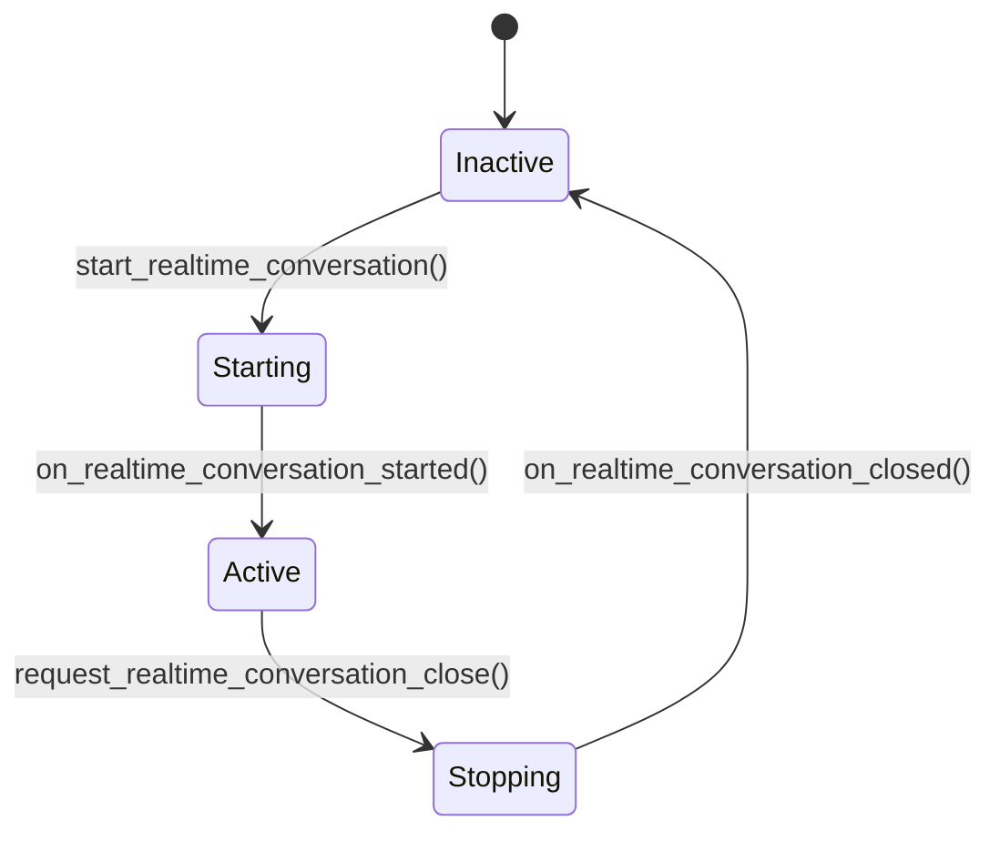

# ChatWidget Tests 研究文档

## 文件信息

- **目标文件**: `codex-rs/tui/src/chatwidget/tests.rs`
- **主模块文件**: `codex-rs/tui/src/chatwidget.rs`
- **子模块目录**: `codex-rs/tui/src/chatwidget/`
- **测试框架**: `tokio::test` + `insta` (snapshot testing)
- **总行数**: ~5000+ 行测试代码

---

## 1. 场景与职责

### 1.1 模块定位

`ChatWidget` 是 Codex TUI（Terminal User Interface）的核心组件，作为**协议事件到UI渲染的适配器**。它负责：

1. **事件处理**: 接收并处理来自 `codex_protocol::protocol::EventMsg` 的事件流
2. **状态管理**: 维护会话状态、历史记录、输入队列、协作模式等
3. **UI渲染**: 通过 `ratatui` 库渲染聊天界面、状态栏、弹出窗口等
4. **用户交互**: 处理键盘输入、命令提交、中断请求等

### 1.2 测试文件职责

`tests.rs` 是 `ChatWidget` 的综合测试套件，覆盖以下场景：

| 场景类别 | 说明 |
|---------|------|
| **会话生命周期** | SessionConfigured、线程fork、历史重放 |
| **消息处理** | 用户消息提交、Agent消息渲染、图片附件处理 |
| **协作模式** | Plan模式、Default模式切换、推理力度选择 |
| **实时对话** | RealtimeConversation 语音会话管理 |
| **中断与恢复** | 用户中断、steer队列管理、消息恢复 |
| **审批流程** | ExecApproval、PatchApproval 的用户确认流程 |
| **限流管理** | RateLimit 快照处理、提示与模型切换建议 |
| **状态指示器** | Working状态、Commentary/Preamble 处理 |

---

## 2. 功能点目的

### 2.1 核心功能测试

#### 2.1.1 初始消息重放 (`resumed_initial_messages_render_history`)

**目的**: 验证会话恢复时历史消息正确渲染。

**关键断言**:
- 用户消息和助手消息都被正确重放
- 文本内容、图片URL、本地图片路径都被保留

```rust
// 测试片段
let configured = SessionConfiguredEvent {
    initial_messages: Some(vec![
        EventMsg::UserMessage(UserMessageEvent { ... }),
        EventMsg::AgentMessage(AgentMessageEvent { ... }),
    ]),
    ...
};
```

#### 2.1.2 线程快照重放去重 (`thread_snapshot_replay_does_not_duplicate_agent_message_history`)

**目的**: 防止历史重放时重复渲染已存在的Agent消息。

**机制**: 通过 `handle_codex_event_replay` 区分重放事件与实时事件，重放时跳过已渲染内容。

#### 2.1.3 图片附件处理

**测试用例**:
- `submission_preserves_text_elements_and_local_images`: 验证本地图片与文本元素提交
- `submission_with_remote_and_local_images_keeps_local_placeholder_numbering`: 验证远程+本地图片混合时的占位符编号
- `enter_with_only_remote_images_submits_user_turn`: 纯远程图片提交

**占位符格式**: `[Image #N]` - 用于在文本中标记图片位置

### 2.2 协作模式测试

#### 2.2.1 Plan模式实现提示 (`plan_implementation_popup_*`)

**目的**: 当Plan模式生成计划后，提示用户是否切换到Default模式执行。

**关键测试**:
- `plan_implementation_popup_shows_after_proposed_plan_output`: 有计划输出时显示提示
- `plan_implementation_popup_skips_when_steer_follows_proposed_plan`: 用户已提交steer时不显示
- `plan_implementation_popup_skips_replayed_turn_complete`: 重放事件不触发

#### 2.2.2 推理力度选择 (`reasoning_selection_*`)

**目的**: 验证模型推理力度（reasoning effort）的选择与持久化。

**状态机**:
```
用户选择模型 -> 检查是否与当前Plan模式不同 -> 
  是 -> 打开范围选择弹窗（Plan only / All modes）
  否 -> 直接更新
```

### 2.3 中断与 steer 管理

#### 2.3.1 Steer 队列机制

**概念**: Steer 是用户在Agent运行期间提交的后续指令。

**测试覆盖**:
- `steer_enter_queues_while_plan_stream_is_active`: Plan流活跃时steer进入队列
- `steer_enter_uses_pending_steers_while_turn_is_running`: 使用pending_steers跟踪已提交但未确认的steer
- `manual_interrupt_restores_pending_steers_to_composer`: 中断时恢复steer到编辑器

**数据结构**:
```rust
struct PendingSteer {
    user_message: UserMessage,
    compare_key: PendingSteerCompareKey, // 用于匹配ItemCompleted事件
}
```

#### 2.3.2 ESC中断行为 (`esc_interrupt_*`)

**目的**: ESC键在中断当前turn的同时，可选择立即提交所有pending steers。

**关键测试**: `esc_interrupt_sends_all_pending_steers_immediately_and_keeps_existing_draft`

### 2.4 限流与配额管理

#### 2.4.1 限流警告 (`rate_limit_warnings_*`)

**阈值机制**:
```rust
const RATE_LIMIT_WARNING_THRESHOLDS: [f64; 3] = [75.0, 90.0, 95.0];
```

**测试验证**:
- 不同使用百分比触发相应警告
- 主/次限制（primary/secondary）分别计算
- 时间窗口转换为人类可读格式（5h/weekly/monthly）

#### 2.4.2 模型切换提示 (`rate_limit_switch_prompt_*`)

**目的**: 当接近限流时，提示用户切换到低成本模型。

**条件**:
- 使用量 >= 90%
- 当前不是低成本模型 (`NUDGE_MODEL_SLUG = "gpt-5.1-codex-mini"`)
- 用户未隐藏提示 (`hide_rate_limit_model_nudge`)

### 2.5 实时语音对话

#### 2.5.1 实时会话状态管理

**状态枚举**:
```rust
enum RealtimeConversationPhase {
    Inactive,
    Starting,
    Active,
    Stopping,
}
```

**关键测试**:
- `ctrl_c_closes_realtime_conversation_before_interrupt_or_quit`: Ctrl+C优先关闭实时会话
- `realtime_error_closes_without_followup_closed_info`: 错误关闭时不显示冗余信息

---

## 3. 具体技术实现

### 3.1 事件分发机制

**核心方法**: `dispatch_event_msg`

```rust
fn dispatch_event_msg(
    &mut self,
    id: Option<String>,        // None表示重放事件
    msg: EventMsg,
    replay_kind: Option<ReplayKind>,
)
```

**处理逻辑**:
1. 区分重放事件 (`from_replay`) 与实时事件
2. 根据 `EventMsg` 类型路由到对应处理器
3. 重放事件跳过某些副作用（如通知、状态更新）

### 3.2 历史记录单元管理

**HistoryCell 类型层次**:
```
HistoryCell (trait)
├── UserHistoryCell       // 用户消息
├── AgentMessageCell      // 助手消息
├── ExecCell              // 命令执行
├── McpToolCallCell       // MCP工具调用
├── WebSearchCell         // 网页搜索
├── PlainHistoryCell      // 纯文本/系统消息
└── FinalMessageSeparator // 回合分隔符
```

**测试工具**: `drain_insert_history` 辅助函数收集 `AppEvent::InsertHistoryCell` 事件

### 3.3 图片附件处理流程

**本地图片**:
1. 用户粘贴/选择图片 → 保存为临时PNG
2. 生成占位符 `[Image #N]` 插入编辑器
3. 提交时转换为 `UserInput::LocalImage`
4. 渲染时显示占位符

**远程图片**:
1. 通过URL直接引用
2. 提交时转换为 `UserInput::Image`
3. 与本地图片分开编号

**占位符重映射** (`remap_placeholders_for_message`):
```rust
// 当合并多个消息时，重新编号占位符以保持连续性
fn remap_placeholders_for_message(message: UserMessage, next_label: &mut usize) -> UserMessage
```

### 3.4 状态指示器管理

**状态恢复机制**:
```rust
// 在Commentary阶段隐藏状态行，完成后恢复
fn maybe_restore_status_indicator_after_stream_idle(&mut self) {
    if !self.pending_status_indicator_restore 
        || !self.bottom_pane.is_task_running() 
        || !self.stream_controllers_idle() {
        return;
    }
    // 恢复状态显示
}
```

**测试验证**: `commentary_completion_restores_status_indicator_before_exec_begin`

### 3.5 Snapshot Testing

**使用 `insta` crate**:
```rust
assert_snapshot!("rate_limit_switch_prompt_popup", popup);
assert_snapshot!("plan_implementation_popup", popup);
```

**渲染辅助函数**:
```rust
fn render_bottom_popup(chat: &ChatWidget, width: u16) -> String {
    let area = Rect::new(0, 0, width, chat.desired_height(width));
    let mut buf = ratatui::buffer::Buffer::empty(area);
    chat.render(area, &mut buf);
    format!("{buf:?}")
}
```

---

## 4. 关键代码路径与文件引用

### 4.1 核心文件依赖

| 文件 | 用途 |
|-----|------|
| `chatwidget.rs` | 主模块，~6200行，包含 `ChatWidget` 结构体及所有事件处理器 |
| `chatwidget/agent.rs` | Agent启动与事件转发循环 |
| `chatwidget/interrupts.rs` | 中断队列管理 (`InterruptManager`) |
| `chatwidget/realtime.rs` | 实时语音对话状态管理 |
| `chatwidget/skills.rs` | Skill提及解析与管理 |
| `chatwidget/session_header.rs` | 会话头部信息 |
| `bottom_pane/mod.rs` | 底部面板（编辑器、状态栏、弹窗） |
| `history_cell.rs` | 历史记录单元类型定义 |

### 4.2 关键测试辅助函数

```rust
// tests.rs 中的辅助函数

// 创建测试实例
async fn make_chatwidget_manual(
    model_override: Option<&str>,
) -> (ChatWidget, UnboundedReceiver<AppEvent>, UnboundedReceiver<Op>)

// 提取历史记录
fn drain_insert_history(
    rx: &mut UnboundedReceiver<AppEvent>,
) -> Vec<Vec<ratatui::text::Line<'static>>>

// 行转字符串
fn lines_to_single_string(lines: &[ratatui::text::Line<'static>]) -> String

// 获取下一个提交操作
fn next_submit_op(op_rx: &mut UnboundedReceiver<Op>) -> Op

// 执行命令辅助
fn begin_exec(chat: &mut ChatWidget, call_id: &str, raw_cmd: &str) -> ExecCommandBeginEvent
fn end_exec(chat: &mut ChatWidget, begin_event: ExecCommandBeginEvent, ...)
```

### 4.3 事件处理关键路径

```
AppEvent::CodexEvent(event)
  └── ChatWidget::handle_codex_event(event)
      └── dispatch_event_msg(id, msg, replay_kind)
          ├── EventMsg::SessionConfigured -> on_session_configured()
          ├── EventMsg::AgentMessageDelta -> on_agent_message_delta()
          ├── EventMsg::TurnStarted -> on_task_started()
          ├── EventMsg::TurnComplete -> on_task_complete()
          ├── EventMsg::ExecCommandBegin -> on_exec_command_begin()
          ├── EventMsg::ExecCommandEnd -> on_exec_command_end()
          └── ...
```

---

## 5. 依赖与外部交互

### 5.1 外部 Crate 依赖

| Crate | 用途 |
|-------|------|
| `ratatui` | TUI渲染框架 |
| `tokio` | 异步运行时 |
| `insta` | Snapshot测试 |
| `crossterm` | 终端输入处理 |
| `codex_protocol` | 协议类型定义 (`EventMsg`, `Op`, etc.) |
| `codex_core` | 核心功能 (Config, AuthManager, etc.) |
| `codex_feedback` | 反馈收集 |

### 5.2 协议交互

**输入** (来自 core):
- `EventMsg` 流：会话配置、消息增量、执行结果、审批请求等

**输出** (发往 core):
- `Op` 类型：
  - `Op::UserTurn` - 用户提交消息
  - `Op::Interrupt` - 中断当前turn
  - `Op::ExecApproval` - 执行审批决策
  - `Op::RealtimeConversationStart/Close` - 实时会话控制

### 5.3 测试隔离策略

```rust
// 使用测试配置避免依赖主机状态
async fn test_config() -> Config {
    let codex_home = std::env::temp_dir();
    ConfigBuilder::default()
        .codex_home(codex_home.clone())
        .build()
        .await
        .expect("config")
}

// 使用 dummy auth 避免真实认证
fn set_chatgpt_auth(chat: &mut ChatWidget) {
    chat.auth_manager = codex_core::test_support::auth_manager_from_auth(
        CodexAuth::create_dummy_chatgpt_auth_for_testing(),
    );
}
```

---

## 6. 风险、边界与改进建议

### 6.1 已知风险点

#### 6.1.1 重放事件处理复杂性

**风险**: 重放事件（`handle_codex_event_replay`）与实时事件处理路径不完全一致，可能导致状态不一致。

**示例**:
```rust
// 重放时跳过某些事件
EventMsg::AgentMessage(...) if from_replay || self.is_review_mode => { ... }
EventMsg::AgentMessage(...) => {} // 实时事件忽略
```

**建议**: 统一重放与实时事件的处理逻辑，通过 `replay_kind` 参数控制副作用而非跳过处理。

#### 6.1.2 Steer 队列顺序依赖

**风险**: `pending_steers` 与 `queued_user_messages` 的交互复杂，中断恢复时顺序可能错乱。

**相关测试**: `manual_interrupt_restores_pending_steers_before_queued_messages`

#### 6.1.3 状态指示器闪烁

**风险**: 在Commentary与FinalAnswer切换时，状态指示器可能出现闪烁。

**缓解**: 通过 `pending_status_indicator_restore` 标志和 `stream_controllers_idle` 检查延迟恢复。

### 6.2 边界条件

| 边界 | 处理 |
|-----|------|
| 空消息提交 | `empty_enter_during_task_does_not_queue` - 空消息不入队 |
| 图片唯一本地 | `replayed_user_message_with_only_local_images_does_not_render_history_cell` - 纯本地图片不渲染 |
| 超长命令 | `exec_approval_decision_truncates_multiline_and_long_commands` - 命令截断显示 |
| 并发steer | `steer_enter_during_final_stream_preserves_follow_up_prompts_in_order` - 保持顺序 |

### 6.3 改进建议

#### 6.3.1 测试组织

**现状**: 所有测试在一个 ~5000 行的文件中。

**建议**: 按功能模块拆分为多个测试文件：
```
chatwidget/
├── tests.rs              # 基础测试
├── tests/
│   ├── session_tests.rs  # 会话生命周期
│   ├── message_tests.rs  # 消息处理
│   ├── collaboration_tests.rs # 协作模式
│   ├── interrupt_tests.rs # 中断与恢复
│   └── rate_limit_tests.rs # 限流管理
```

#### 6.3.2 测试辅助库

**现状**: 辅助函数散落在 `tests.rs` 中。

**建议**: 提取通用测试辅助到 `test_support` 模块：
```rust
// codex-rs/tui/src/test_support/mod.rs
pub struct ChatWidgetTestHarness { ... }
impl ChatWidgetTestHarness {
    pub async fn new() -> Self;
    pub fn submit_message(&mut self, text: &str);
    pub fn drain_history(&mut self) -> Vec<...>;
    pub fn snapshot_popup(&self, name: &str);
}
```

#### 6.3.3 状态机文档

**建议**: 为复杂状态机（如 `RealtimeConversationPhase`、`RateLimitSwitchPromptState`）添加状态转换图：



#### 6.3.4 性能测试

**现状**: 缺乏性能/压力测试。

**建议**: 添加以下测试：
- 大批量历史消息渲染性能
- 高频事件处理（模拟快速打字）
- 内存使用监控（长时间运行会话）

### 6.4 技术债务

| 位置 | 问题 | 建议 |
|-----|------|------|
| `dispatch_event_msg` | 函数过长 (~280行) | 提取匹配臂到独立方法 |
| `make_chatwidget_manual` | 手动构造大量字段 | 使用 Builder 模式简化 |
| 测试断言 | 大量字符串匹配 | 使用结构化断言（如 `assert_matches!`） |

---

## 7. 总结

`chatwidget/tests.rs` 是 Codex TUI 的核心测试套件，覆盖了：

1. **协议事件处理**: 验证 `EventMsg` 到 UI 的正确映射
2. **状态管理**: 验证复杂状态机（协作模式、实时对话、限流）的正确性
3. **用户交互**: 验证键盘输入、提交、中断的响应
4. **渲染一致性**: 通过 snapshot testing 确保 UI 输出稳定

测试设计充分利用了：
- **异步测试**: `tokio::test` 处理异步事件流
- **Snapshot测试**: `insta` 验证复杂UI输出
- **通道验证**: 通过 `UnboundedReceiver` 验证事件发送

主要改进方向包括测试模块化、辅助库提取和性能测试补充。
