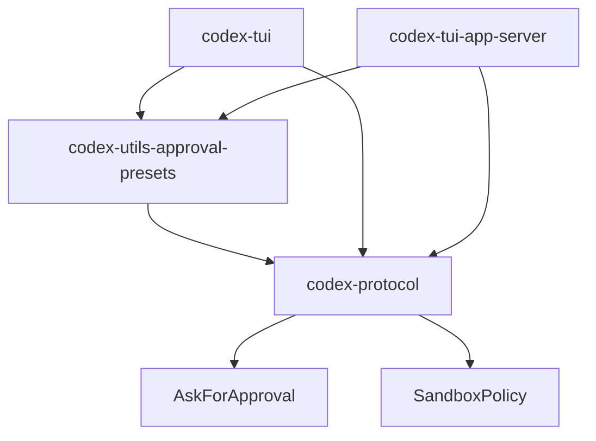

# codex-rs/utils/approval-presets 深度研究文档

## 1. 场景与职责

### 1.1 模块定位

`codex-utils-approval-presets` 是一个轻量级的 Rust 工具库，位于 `codex-rs/utils/approval-presets/` 目录下。该库的核心职责是**提供预定义的权限策略组合（Approval + Sandbox Policy Presets）**，用于简化 Codex CLI/TUI 中的权限配置流程。

### 1.2 业务场景

在 Codex 交互式终端应用（TUI）中，用户需要选择不同的权限模式来控制 AI 代理的行为边界。这些模式涉及两个维度的配置：

1. **Approval Policy（审批策略）**：决定 AI 执行某些操作时是否需要用户明确批准
2. **Sandbox Policy（沙盒策略）**：决定 AI 进程的文件系统访问权限和网络访问权限

为了避免用户手动配置复杂的策略组合，该库提供了三个开箱即用的预设（Preset）：

| 预设 ID | 显示名称 | 适用场景 |
|---------|----------|----------|
| `read-only` | Read Only | 仅允许读取工作区文件，任何编辑或网络访问都需要审批 |
| `auto` | Default | 允许读取和编辑工作区文件、执行命令，但网络访问和外部文件编辑需要审批 |
| `full-access` | Full Access | 完全访问权限，无需审批即可编辑任何文件和访问网络（需谨慎使用） |

### 1.3 设计目标

- **UI 无关性**：库本身不包含任何 UI 代码，可以被 TUI 和 MCP Server 等不同前端复用
- **不可变性**：预设使用 `&'static str` 和编译期常量，确保运行时不可变
- **简单性**：仅暴露一个结构体和一个函数，API 极简

---

## 2. 功能点目的

### 2.1 核心功能

#### 2.1.1 ApprovalPreset 结构体

```rust
pub struct ApprovalPreset {
    pub id: &'static str,           // 稳定标识符
    pub label: &'static str,        // UI 显示标签
    pub description: &'static str,  // 人类可读描述
    pub approval: AskForApproval,   // 审批策略
    pub sandbox: SandboxPolicy,     // 沙盒策略
}
```

该结构体将审批策略和沙盒策略绑定在一起，形成一个完整的权限配置单元。

#### 2.1.2 builtin_approval_presets 函数

```rust
pub fn builtin_approval_presets() -> Vec<ApprovalPreset>
```

返回内置的三个预设配置，供调用方遍历使用。

### 2.2 策略映射详情

#### read-only 预设

```rust
ApprovalPreset {
    id: "read-only",
    label: "Read Only",
    description: "Codex can read files in the current workspace. Approval is required to edit files or access the internet.",
    approval: AskForApproval::OnRequest,
    sandbox: SandboxPolicy::new_read_only_policy(),
}
```

- **审批策略**：`OnRequest` - 模型决定何时请求用户批准
- **沙盒策略**：`ReadOnly` - 仅允许读取，无网络访问

#### auto 预设

```rust
ApprovalPreset {
    id: "auto",
    label: "Default",
    description: "Codex can read and edit files in the current workspace, and run commands. Approval is required to access the internet or edit other files. (Identical to Agent mode)",
    approval: AskForApproval::OnRequest,
    sandbox: SandboxPolicy::new_workspace_write_policy(),
}
```

- **审批策略**：`OnRequest` - 模型决定何时请求用户批准
- **沙盒策略**：`WorkspaceWrite` - 允许读取和写入当前工作区

#### full-access 预设

```rust
ApprovalPreset {
    id: "full-access",
    label: "Full Access",
    description: "Codex can edit files outside this workspace and access the internet without asking for approval. Exercise caution when using.",
    approval: AskForApproval::Never,
    sandbox: SandboxPolicy::DangerFullAccess,
}
```

- **审批策略**：`Never` - 永不请求用户批准
- **沙盒策略**：`DangerFullAccess` - 无限制访问（危险）

---

## 3. 具体技术实现

### 3.1 代码结构

```
codex-rs/utils/approval-presets/
├── BUILD.bazel          # Bazel 构建配置
├── Cargo.toml           # Cargo 包配置
└── src/
    └── lib.rs           # 唯一源文件（46 行）
```

### 3.2 关键数据结构

#### 3.2.1 AskForApproval 枚举

定义位置：`codex-rs/protocol/src/protocol.rs:558-589`

```rust
pub enum AskForApproval {
    UnlessTrusted,              // 仅信任命令自动批准
    OnFailure,                  // 已废弃
    OnRequest,                  // 模型决定何时请求（默认）
    Granular(GranularApprovalConfig),  // 细粒度控制
    Never,                      // 永不请求批准
}
```

#### 3.2.2 SandboxPolicy 枚举

定义位置：`codex-rs/protocol/src/protocol.rs:722-784`

```rust
pub enum SandboxPolicy {
    DangerFullAccess,           // 无限制
    ReadOnly {                  // 只读访问
        access: ReadOnlyAccess,
        network_access: bool,
    },
    ExternalSandbox {           // 外部沙盒
        network_access: NetworkAccess,
    },
    WorkspaceWrite {            // 工作区写入
        writable_roots: Vec<AbsolutePathBuf>,
        read_only_access: ReadOnlyAccess,
        network_access: bool,
        exclude_tmpdir_env_var: bool,
        exclude_slash_tmp: bool,
    },
}
```

#### 3.2.3 辅助方法

**new_read_only_policy()**：

```rust
pub fn new_read_only_policy() -> Self {
    SandboxPolicy::ReadOnly {
        access: ReadOnlyAccess::FullAccess,  // 完整磁盘读取
        network_access: false,               // 无网络
    }
}
```

**new_workspace_write_policy()**：

```rust
pub fn new_workspace_write_policy() -> Self {
    SandboxPolicy::WorkspaceWrite {
        writable_roots: vec![],              // 默认无额外写入根
        read_only_access: ReadOnlyAccess::FullAccess,
        network_access: false,               // 无网络
        exclude_tmpdir_env_var: false,       // 包含 TMPDIR
        exclude_slash_tmp: false,            // 包含 /tmp
    }
}
```

### 3.3 依赖关系

```
codex-utils-approval-presets
└── codex-protocol (workspace)
    ├── AskForApproval 枚举
    └── SandboxPolicy 枚举
```

Cargo.toml 依赖声明：

```toml
[dependencies]
codex-protocol = { workspace = true }
```

---

## 4. 关键代码路径与文件引用

### 4.1 本库文件

| 文件 | 行数 | 描述 |
|------|------|------|
| `src/lib.rs` | 46 | 包含 `ApprovalPreset` 结构体和 `builtin_approval_presets()` 函数 |
| `Cargo.toml` | 11 | 包配置，依赖 codex-protocol |
| `BUILD.bazel` | 6 | Bazel 构建规则 |

### 4.2 调用方代码路径

#### 4.2.1 TUI 模块 (`codex-rs/tui/`)

**导入位置**：`src/chatwidget.rs:306-307`

```rust
use codex_utils_approval_presets::ApprovalPreset;
use codex_utils_approval_presets::builtin_approval_presets;
```

**使用位置 1**：权限选择弹窗（约第 7058 行）

```rust
let presets: Vec<ApprovalPreset> = builtin_approval_presets();
```

用于构建权限预设选择列表，遍历所有预设生成 UI 选项。

**使用位置 2**：Windows 沙盒启用提示（约第 7774 行）

```rust
let Some(preset) = builtin_approval_presets()
    .into_iter()
    .find(|preset| preset.id == "auto")
```

查找 "auto" 预设用于 Windows 沙盒启用流程。

**使用位置 3**：降级模式命令处理（约第 4443 行）

```rust
let Some(preset) = builtin_approval_presets()
    .into_iter()
    .find(|preset| preset.id == "auto")
```

在降级模式下应用默认预设。

#### 4.2.2 TUI App Server 模块 (`codex-rs/tui_app_server/`)

**导入位置**：`src/chatwidget.rs:347-348`

```rust
use codex_utils_approval_presets::ApprovalPreset;
use codex_utils_approval_presets::builtin_approval_presets;
```

**使用位置**：与 TUI 模块类似，位于约第 8134、8853、4676 行

#### 4.2.3 App Event 定义

**TUI**：`src/app_event.rs:19`

```rust
use codex_utils_approval_presets::ApprovalPreset;
```

用于 `AppEvent::OpenFullAccessConfirmation` 等事件携带预设参数。

**TUI App Server**：`src/app_event.rs:21`

相同用法。

#### 4.2.4 测试文件

**TUI 测试**：`src/chatwidget/tests.rs:125`

```rust
use codex_utils_approval_presets::builtin_approval_presets;
```

**TUI App Server 测试**：`src/chatwidget/tests.rs:148`

相同用法。

### 4.3 被依赖类型定义

| 类型 | 定义位置 | 描述 |
|------|----------|------|
| `AskForApproval` | `codex-rs/protocol/src/protocol.rs:558` | 审批策略枚举 |
| `SandboxPolicy` | `codex-rs/protocol/src/protocol.rs:722` | 沙盒策略枚举 |
| `new_read_only_policy()` | `codex-rs/protocol/src/protocol.rs:843` | 只读策略工厂方法 |
| `new_workspace_write_policy()` | `codex-rs/protocol/src/protocol.rs:853` | 工作区写入策略工厂方法 |

---

## 5. 依赖与外部交互

### 5.1 直接依赖



### 5.2 Workspace 配置

在 `codex-rs/Cargo.toml` 中定义：

```toml
[workspace.dependencies]
codex-utils-approval-presets = { path = "utils/approval-presets" }
```

### 5.3 调用方 Cargo.toml 依赖

**codex-tui/Cargo.toml:47**：

```toml
codex-utils-approval-presets = { workspace = true }
```

**codex-tui-app-server/Cargo.toml:51**：

```toml
codex-utils-approval-presets = { workspace = true }
```

### 5.4 交互流程

```
用户操作 -> ChatWidget -> builtin_approval_presets() -> 
返回 ApprovalPreset -> 应用 approval + sandbox 策略 -> 
更新 Config -> 影响后续 AI 行为
```

---

## 6. 风险、边界与改进建议

### 6.1 当前风险

#### 6.1.1 硬编码预设 ID

代码中多处使用字符串字面量查找预设（如 `"auto"`、`"full-access"`）：

```rust
.find(|preset| preset.id == "auto")
```

**风险**：如果预设 ID 被修改，查找会失败，导致运行时错误。

**缓解**：调用方已做防御性处理，返回 `Option` 并在失败时显示错误消息。

#### 6.1.2 静态字符串生命周期

使用 `&'static str` 限制了预设只能从编译期常量创建，无法支持动态加载的预设。

#### 6.1.3 预设数量固定

目前只有 3 个硬编码预设，无法通过配置扩展。

### 6.2 边界情况

#### 6.2.1 预设查找失败

在 `codex-rs/tui/src/chatwidget.rs:4443-4453`：

```rust
let Some(preset) = builtin_approval_presets()
    .into_iter()
    .find(|preset| preset.id == "auto")
else {
    self.add_error_message(
        "Internal error: missing the 'auto' approval preset.".to_string()
    );
    return;
};
```

边界处理：优雅降级，显示错误消息而非 panic。

#### 6.2.2 Windows 平台特殊处理

Windows 沙盒启用流程中，预设被用于多阶段确认对话框：

1. `OpenWindowsSandboxEnablePrompt`
2. `OpenWindowsSandboxFallbackPrompt`
3. `BeginWindowsSandboxElevatedSetup`
4. `BeginWindowsSandboxLegacySetup`

这些事件都携带 `ApprovalPreset` 参数，确保用户在确认后应用正确的策略。

### 6.3 改进建议

#### 6.3.1 使用常量替代字符串字面量

建议定义公开的常量：

```rust
pub const PRESET_ID_READ_ONLY: &str = "read-only";
pub const PRESET_ID_AUTO: &str = "auto";
pub const PRESET_ID_FULL_ACCESS: &str = "full-access";
```

避免调用方硬编码字符串。

#### 6.3.2 提供查找辅助函数

```rust
pub fn find_preset(id: &str) -> Option<ApprovalPreset> {
    builtin_approval_presets()
        .into_iter()
        .find(|p| p.id == id)
}

pub fn auto_preset() -> Option<ApprovalPreset> {
    find_preset("auto")
}
```

#### 6.3.3 支持动态预设

将 `&'static str` 改为 `String` 或 `Cow<'static, str>`，允许运行时创建的预设。

#### 6.3.4 添加预设验证测试

确保所有预设 ID 唯一且必需的预设（如 "auto"）始终存在：

```rust
#[test]
fn auto_preset_must_exist() {
    assert!(builtin_approval_presets()
        .into_iter()
        .any(|p| p.id == "auto"));
}

#[test]
fn preset_ids_are_unique() {
    let ids: Vec<_> = builtin_approval_presets()
        .into_iter()
        .map(|p| p.id)
        .collect();
    let unique: std::collections::HashSet<_> = ids.iter().cloned().collect();
    assert_eq!(ids.len(), unique.len());
}
```

#### 6.3.5 文档增强

在 `ApprovalPreset` 结构体上添加更多文档注释，说明各字段的用途和约束：

```rust
/// A simple preset pairing an approval policy with a sandbox policy.
/// 
/// # Design Notes
/// - `id` should be unique among all presets
/// - `label` is displayed in UI selection lists
/// - `description` should clearly explain the security implications
/// - Both `approval` and `sandbox` policies are applied together
#[derive(Debug, Clone)]
pub struct ApprovalPreset {
    // ...
}
```

### 6.4 测试覆盖

当前测试主要集中在调用方（TUI 和 TUI App Server），本库本身没有单元测试。建议添加：

1. 预设结构正确性测试
2. 预设 ID 唯一性测试
3. 预设查找辅助函数测试（如果添加）

---

## 7. 总结

`codex-utils-approval-presets` 是一个职责单一、设计简洁的工具库。它通过将审批策略和沙盒策略绑定为预设，简化了 Codex TUI 中的权限配置流程。虽然代码量很小（仅 46 行），但它是连接用户界面和核心权限系统的关键桥梁。

库的设计遵循了"UI 无关性"原则，可以被多个前端复用。当前实现使用了编译期常量，确保了运行时性能，但也限制了动态扩展能力。在安全性方面，调用方已对预设查找失败做了防御性处理。

未来的改进可以围绕：常量定义规范化、查找辅助函数、动态预设支持、以及更完善的测试覆盖展开。
